# Gmail MCP Server - Complete Architecture Plan

## Quick Start Guide

### Prerequisites
- Node.js 18+ and npm installed
- A Google Cloud Platform account
- Gmail API enabled in your GCP project
- OAuth2 credentials (Client ID and Client Secret)

### Installation Steps

1. **Clone and Install**
   ```bash
   git clone <repository-url>
   cd gmail-mcp-server
   npm install
   npm run build
   ```

2. **Set Up Google Cloud Credentials**
   - Go to [Google Cloud Console](https://console.cloud.google.com)
   - Create a new project or select existing
   - Enable Gmail API
   - Create OAuth2 credentials (Desktop application type)
   - Download credentials as `credentials.json`
   - Place in project root

3. **Configure Environment**
   ```bash
   # Create .env file
   cp .env.example .env
   
   # Edit .env with your settings
   GOOGLE_CLIENT_ID=your_client_id
   GOOGLE_CLIENT_SECRET=your_client_secret
   GOOGLE_REDIRECT_URI=http://localhost:3000/oauth2callback
   STORAGE_PATH=./data
   CACHE_TTL=3600
   ```

4. **First Run - Authentication**
   ```bash
   # Start the MCP server
   npm start
   
   # In your MCP client, run:
   # Tool: authenticate
   # This will open a browser for Google OAuth
   ```

5. **Basic Usage Examples**

   **Categorize Your Emails:**
   ```json
   {
     "tool": "categorize_emails",
     "arguments": {
       "force_refresh": true
     }
   }
   ```

   **Search High Priority Emails:**
   ```json
   {
     "tool": "search_emails",
     "arguments": {
       "category": "high",
       "year_range": { "start": 2024 }
     }
   }
   ```

   **Archive Old Low Priority Emails:**
   ```json
   {
     "tool": "archive_emails",
     "arguments": {
       "category": "low",
       "older_than_days": 90,
       "method": "gmail"
     }
   }
   ```

   **Get Email Statistics:**
   ```json
   {
     "tool": "get_email_stats",
     "arguments": {
       "group_by": "all"
     }
   }
   ```

### Common Workflows

1. **Initial Email Organization**
   ```bash
   # 1. Authenticate
   authenticate
   
   # 2. Categorize all emails
   categorize_emails { "force_refresh": true }
   
   # 3. View statistics
   get_email_stats { "group_by": "all" }
   
   # 4. Review high priority emails
   list_emails { "category": "high", "limit": 20 }
   ```

2. **Clean Up Old Emails**
   ```bash
   # 1. Search for old large emails
   search_emails { 
     "year_range": { "end": 2022 },
     "size_range": { "min": 5242880 }
   }
   
   # 2. Archive them
   archive_emails {
     "year": 2022,
     "size_threshold": 5242880,
     "method": "export",
     "export_format": "mbox"
   }
   
   # 3. Delete if needed (after confirming archive)
   delete_emails {
     "year": 2022,
     "size_threshold": 5242880,
     "confirm": true
   }
   ```

3. **Set Up Automatic Archiving**
   ```bash
   # Create rule for low priority emails
   create_archive_rule {
     "name": "Auto-archive low priority",
     "criteria": {
       "category": "low",
       "older_than_days": 60
     },
     "action": { "method": "gmail" },
     "schedule": "weekly"
   }
   ```

### Troubleshooting

**Authentication Issues:**
- Ensure credentials.json is in the correct location
- Check that Gmail API is enabled in GCP
- Verify redirect URI matches your configuration

**Rate Limiting:**
- The server implements automatic retry with exponential backoff
- For large operations, use `dry_run: true` first
- Monitor the rate limit status in logs

**Performance:**
- First categorization may take time for large mailboxes
- Use pagination (`limit` and `offset`) for large result sets
- Enable caching in production

### MCP Client Configuration

**For Claude Desktop:**
```json
{
  "mcpServers": {
    "gmail": {
      "command": "node",
      "args": ["/path/to/gmail-mcp-server/build/index.js"],
      "env": {
        "NODE_ENV": "production"
      }
    }
  }
}
```

**For Other MCP Clients:**
```bash
# Direct stdio connection
node /path/to/gmail-mcp-server/build/index.js

# With environment variables
NODE_ENV=production node /path/to/gmail-mcp-server/build/index.js
```

---

## Overview
We'll build an MCP (Model Context Protocol) server that integrates with Gmail API to provide intelligent email management capabilities with categorization, search, archiving, and deletion features.

## Key Features

### 1. Email Categorization by Importance
- **High Priority**: Emails from important contacts, work-related, urgent keywords
- **Medium Priority**: Regular correspondence, newsletters from subscribed services
- **Low Priority**: Promotional emails, automated notifications

### 2. Email Categorization by Year and Size
- Group emails by year (2024, 2023, etc.)
- Categorize by size: Small (<100KB), Medium (100KB-1MB), Large (>1MB)
- Calculate total storage used per category

### 3. Advanced Search Functionality
- Search within specific importance categories
- Search by year range and size range
- Combine multiple filters (importance + year + size + keywords)
- Search by sender, subject, or content within categories
- Save and reuse search queries

### 4. Email Archiving
- Archive by category, year, or search results
- Automatic archiving rules (e.g., archive low priority emails older than 6 months)
- Archive to Gmail's built-in archive or export to external storage
- Restore archived emails
- Archive statistics and management

### 5. Smart Delete Functionality
- Delete by importance level
- Delete by year range
- Delete by size threshold
- Delete based on search results
- Bulk delete with safety confirmations

## Technical Architecture

```mermaid
graph TB
    subgraph "MCP Server Core"
        A[Gmail MCP Server] --> B[Authentication Module]
        A --> C[Email Fetcher]
        A --> D[Categorization Engine]
        A --> E[Delete Manager]
        A --> F[Search Engine]
        A --> G[Archive Manager]
        
        B --> H[OAuth2 Handler]
        B --> I[Token Storage]
        
        C --> J[Gmail API Client]
        C --> K[Batch Processor]
        
        D --> L[Importance Analyzer]
        D --> M[Date/Size Analyzer]
        D --> N[Cache Manager]
        
        E --> O[Safe Delete Logic]
        E --> P[Batch Delete]
        
        F --> Q[Query Builder]
        F --> R[Filter Combiner]
        F --> S[Search Cache]
        
        G --> T[Archive Rules Engine]
        G --> U[Export Manager]
        G --> V[Archive Index]
    end
    
    subgraph "Storage"
        N --> W[(Local Cache DB)]
        V --> X[(Archive Metadata)]
        U --> Y[External Storage]
    end
    
    subgraph "External Services"
        J --> Z[Gmail API]
        H --> AA[Google OAuth]
        Y --> AB[Cloud Storage]
    end
    
    subgraph "MCP Tools"
        AC[authenticate] --> B
        AD[list_emails] --> C
        AE[search_emails] --> F
        AF[categorize_emails] --> D
        AG[get_email_stats] --> D
        AH[delete_emails] --> E
        AI[archive_emails] --> G
        AJ[restore_emails] --> G
        AK[create_archive_rule] --> G
        AL[list_archive_rules] --> G
        AM[export_emails] --> U
    end
```



## Implementation Plan

### Phase 1: Project Setup
1. Initialize TypeScript project with MCP SDK
2. Set up Gmail API credentials and OAuth2
3. Create basic MCP server structure
4. Set up SQLite for local metadata storage
5. Configure development and testing environment

### Phase 2: Authentication
1. Implement OAuth2 flow for Gmail
2. Secure token storage (encrypted local storage)
3. Token refresh mechanism
4. Multi-account support preparation

### Phase 3: Email Fetching & Analysis
1. Implement batch email fetching with pagination
2. Create importance scoring algorithm
   - Sender reputation scoring
   - Keyword analysis
   - Thread importance inheritance
3. Build date and size analyzers
4. Metadata extraction and indexing

### Phase 4: Categorization Engine
1. Multi-dimensional categorization logic
2. Real-time categorization for new emails
3. Caching for performance
4. Statistics generation and aggregation

### Phase 5: Search Functionality
1. Query language design
   - Simple text search
   - Advanced filter syntax
2. Search index creation
3. Filter combination logic
4. Search result ranking
5. Saved search management

### Phase 6: Archive System
1. Archive rules engine
   - Time-based rules
   - Category-based rules
   - Size-based rules
2. Gmail archive integration
3. External export functionality
   - MBOX format
   - JSON export
   - Cloud storage integration
4. Archive index and search
5. Restore functionality

### Phase 7: Delete Functionality
1. Safe delete with confirmations
2. Batch delete operations
3. Delete based on search results
4. Undo mechanism (trash management)
5. Permanent delete options

## MCP Tools API Reference

### 1. authenticate
Initiates OAuth2 flow for Gmail authentication.

**Input:**
```typescript
{
  scopes?: string[]
}
```

**Output:**
```typescript
{
  success: boolean,
  email: string
}
```

### 2. list_emails
Lists emails with optional filters.

**Input:**
```typescript
{
  category?: 'high' | 'medium' | 'low',
  year?: number,
  size_range?: { min?: number, max?: number },
  archived?: boolean,
  limit?: number,
  offset?: number
}
```

**Output:**
```typescript
{
  emails: Email[],
  total: number
}
```

### 3. search_emails
Advanced email search with multiple filter options.

**Input:**
```typescript
{
  query?: string,
  category?: 'high' | 'medium' | 'low',
  year_range?: { start?: number, end?: number },
  size_range?: { min?: number, max?: number },
  sender?: string,
  has_attachments?: boolean,
  archived?: boolean,
  limit?: number
}
```

**Output:**
```typescript
{
  emails: Email[],
  total: number
}
```

### 4. archive_emails
Archives emails based on specified criteria.

**Input:**
```typescript
{
  search_criteria?: SearchCriteria,
  category?: 'high' | 'medium' | 'low',
  year?: number,
  older_than_days?: number,
  method: 'gmail' | 'export',
  export_format?: 'mbox' | 'json',
  export_path?: string,
  dry_run?: boolean
}
```

**Output:**
```typescript
{
  archived: number,
  location?: string,
  errors: string[]
}
```

### 5. restore_emails
Restores previously archived emails.

**Input:**
```typescript
{
  archive_id?: string,
  email_ids?: string[],
  restore_labels?: string[]
}
```

**Output:**
```typescript
{
  restored: number,
  errors: string[]
}
```

### 6. create_archive_rule
Creates automatic archive rules.

**Input:**
```typescript
{
  name: string,
  criteria: {
    category?: 'high' | 'medium' | 'low',
    older_than_days?: number,
    size_greater_than?: number,
    labels?: string[]
  },
  action: {
    method: 'gmail' | 'export',
    export_format?: 'mbox' | 'json'
  },
  schedule?: 'daily' | 'weekly' | 'monthly'
}
```

**Output:**
```typescript
{
  rule_id: string,
  created: boolean
}
```

### 7. list_archive_rules
Lists all configured archive rules.

**Input:**
```typescript
{
  active_only?: boolean
}
```

**Output:**
```typescript
{
  rules: ArchiveRule[]
}
```

### 8. export_emails
Exports emails to external formats.

**Input:**
```typescript
{
  search_criteria?: SearchCriteria,
  format: 'mbox' | 'json' | 'csv',
  include_attachments?: boolean,
  output_path?: string,
  cloud_upload?: {
    provider: 'gdrive' | 's3' | 'dropbox',
    path: string
  }
}
```

**Output:**
```typescript
{
  exported: number,
  file_path: string,
  size: number
}
```

### 9. categorize_emails
Analyzes and categorizes emails.

**Input:**
```typescript
{
  force_refresh?: boolean,
  year?: number
}
```

**Output:**
```typescript
{
  processed: number,
  categories: CategoryStats
}
```

### 10. get_email_stats
Returns comprehensive email statistics.

**Input:**
```typescript
{
  group_by: 'category' | 'year' | 'size' | 'archived' | 'all',
  include_archived?: boolean
}
```

**Output:**
```typescript
{
  stats: EmailStatistics
}
```

### 11. delete_emails
Deletes emails based on criteria with safety checks.

**Input:**
```typescript
{
  search_criteria?: SearchCriteria,
  category?: 'high' | 'medium' | 'low',
  year?: number,
  size_threshold?: number,
  skip_archived?: boolean,
  dry_run?: boolean,
  confirm?: boolean
}
```

**Output:**
```typescript
{
  deleted: number,
  errors: string[]
}
```

## Data Models

### EmailIndex
```typescript
interface EmailIndex {
  id: string;
  threadId: string;
  category: 'high' | 'medium' |