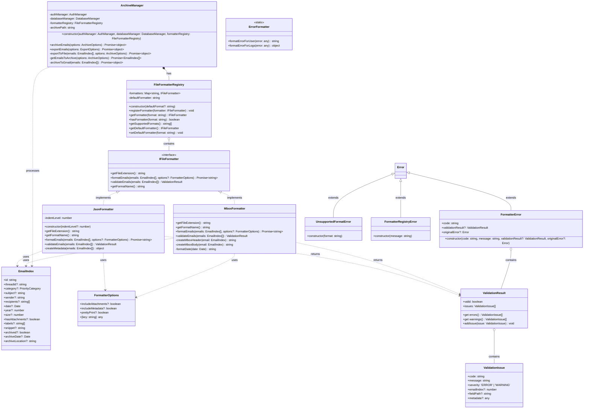

# IFileFormatter Interface Design Document

## 1. Overview

This document outlines the design for a file formatter abstraction layer for the Archive Management System in the Gmail MCP Server project. The current implementation in `ArchiveManager.ts` has hardcoded export format handling with only JSON implemented, while MBOX format is needed but throws a "not yet implemented" error. This design proposes a clean abstraction layer for supporting multiple export formats, making it easy to add new formats in the future without changing existing code.

## 2. Interface Design

### 2.1 IFileFormatter Interface

```typescript
export interface IFileFormatter {
  /**
   * Returns the file extension this formatter handles (without the dot)
   */
  getFileExtension(): string;
  
  /**
   * Returns a human-readable name for this format
   */
  getFormatName(): string;
  
  /**
   * Formats the provided emails into the target format
   * @param emails List of email indexes to format
   * @param options Additional formatting options
   * @returns Formatted content as a string
   */
  formatEmails(emails: EmailIndex[], options?: FormatterOptions): Promise<string>;

  /**
   * Validates if the provided emails can be formatted with this formatter
   * @param emails List of email indexes to validate
   * @returns Validation result with any potential issues
   */
  validateEmails(emails: EmailIndex[]): ValidationResult;
}
```

### 2.2 FormatterOptions Interface

```typescript
export interface FormatterOptions {
  // Common options for all formatters
  includeAttachments?: boolean;
  includeMetadata?: boolean;
  prettyPrint?: boolean;
  maxSizeBytes?: number;
  
  // Format-specific options can be added via string indexing
  [key: string]: any;
}
```

### 2.3 ValidationResult Interface

```typescript
export interface ValidationIssue {
  code: string;           // Machine-readable error code (e.g., 'MISSING_SENDER')
  message: string;        // Human-readable error message
  severity: 'ERROR' | 'WARNING';  // Issue severity
  emailIndex?: number;    // Index of problematic email (if applicable)
  fieldPath?: string;     // Path to problematic field (e.g., 'sender', 'payload.headers')
  metadata?: any;         // Additional context
}

export interface ValidationResult {
  valid: boolean;         // Overall validity (no errors, warnings are ok)
  issues: ValidationIssue[]; // Combined list of all issues
  
  // Helper accessors
  get errors(): ValidationIssue[] {
    return this.issues.filter(issue => issue.severity === 'ERROR');
  }
  
  get warnings(): ValidationIssue[] {
    return this.issues.filter(issue => issue.severity === 'WARNING');
  }
  
  // Helper method to add issues
  addIssue(issue: ValidationIssue): void {
    this.issues.push(issue);
    if (issue.severity === 'ERROR') {
      this.valid = false;
    }
  }
}
```

### 2.4 Custom Error Classes

```typescript
export class FormatterError extends Error {
  public readonly code: string;
  public readonly validationResult?: ValidationResult;
  public readonly originalError?: Error;
  
  constructor(
    code: string,
    message: string,
    validationResult?: ValidationResult,
    originalError?: Error
  ) {
    super(message);
    this.name = 'FormatterError';
    this.code = code;
    this.validationResult = validationResult;
    this.originalError = originalError;
    
    // Maintain proper stack trace
    if (Error.captureStackTrace) {
      Error.captureStackTrace(this, FormatterError);
    }
  }
}

export class UnsupportedFormatError extends Error {
  constructor(format: string) {
    super(`Unsupported format: ${format}`);
    this.name = 'UnsupportedFormatError';
    
    if (Error.captureStackTrace) {
      Error.captureStackTrace(this, UnsupportedFormatError);
    }
  }
}

export class FormatterRegistryError extends Error {
  constructor(message: string) {
    super(message);
    this.name = 'FormatterRegistryError';
    
    if (Error.captureStackTrace) {
      Error.captureStackTrace(this, FormatterRegistryError);
    }
  }
}
```

## 3. Formatter Registry

The FileFormatterRegistry will manage the available formatters and provide a way to retrieve formatters by format name or extension.

```typescript
export class FileFormatterRegistry {
  private formatters: Map<string, IFileFormatter> = new Map();
  private defaultFormatter: string = 'json';
  
  constructor(defaultFormat?: string) {
    if (defaultFormat) {
      this.defaultFormatter = defaultFormat.toLowerCase();
    }
  }
  
  /**
   * Register a formatter 
   * @param formatter The formatter implementation
   */
  registerFormatter(formatter: IFileFormatter): void {
    const format = formatter.getFileExtension().toLowerCase();
    this.formatters.set(format, formatter);
  }
  
  /**
   * Get a formatter for a specific format
   * @param format The format name or file extension
   */
  getFormatter(format: string): IFileFormatter | undefined {
    const normalizedFormat = format.toLowerCase();
    const formatter = this.formatters.get(normalizedFormat);
    
    if (!formatter) {
      // Try to find by file extension without dot
      if (normalizedFormat.startsWith('.')) {
        const withoutDot = normalizedFormat.substring(1);
        const formatterByExt = this.formatters.get(withoutDot);
        if (formatterByExt) {
          return formatterByExt;
        }
      }
      
      // If still not found, try to find by name
      const matchByName = Array.from(this.formatters.values())
        .find(f => f.getFormatName().toLowerCase() === normalizedFormat);
      
      if (matchByName) {
        return matchByName;
      }
      
      // No formatter found
      throw new UnsupportedFormatError(format);
    }
    
    return formatter;
  }
  
  /**
   * Check if a formatter exists for a specific format
   * @param format The format name or file extension
   */
  hasFormatter(format: string): boolean {
    const normalizedFormat = format.toLowerCase();
    return this.formatters.has(normalizedFormat);
  }
  
  /**
   * Get all supported formats
   */
  getSupportedFormats(): string[] {
    return Array.from(this.formatters.keys());
  }
  
  /**
   * Get the default formatter
   */
  getDefaultFormatter(): IFileFormatter | undefined {
    return this.formatters.get(this.defaultFormatter);
  }
  
  /**
   * Set the default formatter
   * @param format The format to set as default
   */
  setDefaultFormatter(format: string): void {
    if (!this.hasFormatter(format)) {
      throw new Error(`Cannot set default formatter: format ${format} is not registered`);
    }
    this.defaultFormatter = format.toLowerCase();
  }
}
```

## 4. Formatter Implementations

### 4.1 JsonFormatter

```typescript
export class JsonFormatter implements IFileFormatter {
  private indentLevel: number;
  
  constructor(indentLevel: number = 2) {
    this.indentLevel = indentLevel;
  }
  
  getFileExtension(): string {
    return 'json';
  }
  
  getFormatName(): string {
    return 'JSON';
  }
  
  async formatEmails(emails: EmailIndex[], options?: FormatterOptions): Promise<string> {
    try {
      // Perform validation first
      const validationResult = this.validateEmails(emails);
      
      // If there are errors, don't proceed with formatting
      if (!validationResult.valid) {
        throw new FormatterError(
          'VALIDATION_FAILED',
          `Cannot format emails: ${validationResult.errors.map(e => e.message).join('; ')}`,
          validationResult
        );
      }
      
      const prettyPrint = options?.prettyPrint !== false;
      
      const data = {
        exportDate: new Date(),
        emailCount: emails.length,
        emails: emails,
        metadata: options?.includeMetadata ? this.createMetadata(emails) : undefined
      };
      
      return JSON.stringify(data, null, prettyPrint ? this.indentLevel : 0);
    } catch (error) {
      // Check if this is already a formatter error
      if (error instanceof FormatterError) {
        throw error;
      }
      
      // Otherwise, wrap it
      throw new FormatterError(
        'UNEXPECTED_ERROR',
        `Unexpected error in ${this.getFormatName()} formatter: ${error.message}`,
        null,
        error
      );
    }
  }
  
  validateEmails(emails: EmailIndex[]): ValidationResult {
    const result = ValidationResultFactory.createValid();
    
    // Check for circular references (a common JSON serialization issue)
    try {
      // Test serialization
      JSON.stringify(emails);
    } catch (error) {
      result.addIssue({
        code: 'JSON_CIRCULAR_REF',
        message: `Cannot serialize to JSON: ${error.message}`,
        severity: 'ERROR'
      });
      return result;
    }
    
    // Check for extremely large emails that might cause performance issues
    const sizeWarningThreshold = 10 * 1024 * 1024; // 10MB
    
    emails.forEach((email, index) => {
      // Check for missing required fields
      if (!email.id) {
        result.addIssue({
          code: 'MISSING_ID',
          message: `Email at index ${index} is missing ID`,
          severity: 'ERROR',
          emailIndex: index,
          fieldPath: 'id'
        });
      }
      
      // Check size warning
      if (email.size && email.size > sizeWarningThreshold) {
        result.addIssue({
          code: 'LARGE_EMAIL',
          message: `Email at index ${index} is very large (${(email.size / 1024 / 1024).toFixed(2)}MB), which may cause performance issues`,
          severity: 'WARNING',
          emailIndex: index,
          fieldPath: 'size',
          metadata: { size: email.size }
        });
      }
    });
    
    return result;
  }
  
  private createMetadata(emails: EmailIndex[]): object {
    // Create metadata about the exported emails
    return {
      exportTimestamp: new Date().toISOString(),
      totalEmails: emails.length,
      sizeStats: this.calculateSizeStats(emails),
      dateRange: this.calculateDateRange(emails)
    };
  }
  
  private calculateSizeStats(emails: EmailIndex[]) {
    const totalSize = emails.reduce((sum, email) => sum + (email.size || 0), 0);
    return {
      totalSize,
      averageSize: emails.length ? totalSize / emails.length : 0
    };
  }
  
  private calculateDateRange(emails: EmailIndex[]) {
    const dates = emails
      .filter(email => email.date instanceof Date)
      .map(email => email.date as Date);
    
    if (dates.length === 0) {
      return { earliest: null, latest: null };
    }
    
    return {
      earliest: new Date(Math.min(...dates.map(d => d.getTime()))).toISOString(),
      latest: new Date(Math.max(...dates.map(d => d.getTime()))).toISOString()
    };
  }
}
```

### 4.2 MboxFormatter

```typescript
export class MboxFormatter implements IFileFormatter {
  getFileExtension(): string {
    return 'mbox';
  }
  
  getFormatName(): string {
    return 'Mbox';
  }
  
  async formatEmails(emails: EmailIndex[], options?: FormatterOptions): Promise<string> {
    try {
      // Perform validation first
      const validationResult = this.validateEmails(emails);
      
      // If there are errors, don't proceed with formatting
      if (!validationResult.valid) {
        throw new FormatterError(
          'VALIDATION_FAILED',
          `Cannot format emails: ${validationResult.errors.map(e => e.message).join('; ')}`,
          validationResult
        );
      }
      
      // Implement MBOX format according to RFC4155
      let mboxContent = '';
      
      for (const email of emails) {
        mboxContent += this.createMboxHeader(email);
        mboxContent += this.createMboxBody(email);
        mboxContent += '\n';
      }
      
      return mboxContent;
    } catch (error) {
      // Check if this is already a formatter error
      if (error instanceof FormatterError) {
        throw error;
      }
      
      // Otherwise, wrap it
      throw new FormatterError(
        'UNEXPECTED_ERROR',
        `Unexpected error in ${this.getFormatName()} formatter: ${error.message}`,
        null,
        error
      );
    }
  }
  
  validateEmails(emails: EmailIndex[]): ValidationResult {
    const result = ValidationResultFactory.createValid();
    
    // MBOX format requires specific fields
    emails.forEach((email, index) => {
      // From line is critical in MBOX format
      if (!email.sender) {
        result.addIssue({
          code: 'MISSING_SENDER',
          message: `Email at index ${index} is missing sender information, which is required for MBOX format`,
          severity: 'ERROR',
          emailIndex: index,
          fieldPath: 'sender'
        });
      } else if (!this.isValidSender(email.sender)) {
        result.addIssue({
          code: 'INVALID_SENDER',
          message: `Email at index ${index} has an invalid sender format: "${email.sender}"`,
          severity: 'ERROR',
          emailIndex: index,
          fieldPath: 'sender'
        });
      }
      
      // Date is important for MBOX format, but we can use a default if missing
      if (!email.date) {
        result.addIssue({
          code: 'MISSING_DATE',
          message: `Email at index ${index} is missing date information, a default will be used`,
          severity: 'WARNING',
          emailIndex: index,
          fieldPath: 'date'
        });
      }
      
      // Content checks
      if (!email.snippet && !email.hasAttachments) {
        result.addIssue({
          code: 'EMPTY_CONTENT',
          message: `Email at index ${index} appears to have no content or attachments`,
          severity: 'WARNING',
          emailIndex: index
        });
      }
    });
    
    return result;
  }
  
  private createMboxHeader(email: EmailIndex): string {
    // Create MBOX format header (From line)
    const fromLine = `From ${email.sender || 'unknown'} ${this.formatDate(email.date || new Date())}\n`;
    return fromLine;
  }
  
  private createMboxBody(email: EmailIndex): string {
    // Create MBOX format email body with headers and content
    return `Subject: ${email.subject || '(No Subject)'}\n` +
           `From: ${email.sender || 'unknown'}\n` +
           `Date: ${email.date ? email.date.toUTCString() : new Date().toUTCString()}\n\n` +
           `${email.snippet || ''}\n`;
  }
  
  private formatDate(date: Date): string {
    // Format date for MBOX From line according to RFC4155
    return date.toUTCString().replace('GMT', '+0000');
  }
  
  // Helper method to validate sender format
  private isValidSender(sender: string): boolean {
    // Basic check for email format
    return /^[^@\s]+@[^@\s]+\.[^@\s]+$/.test(sender) || 
           // OR name + email format
           /^.+\s<[^@\s]+@[^@\s]+\.[^@\s]+>$/.test(sender);
  }
}
```

## 5. Integration with ArchiveManager

The `ArchiveManager` class will be updated to use the formatter registry:

```typescript
export class ArchiveManager {
  private authManager: AuthManager;
  private databaseManager: DatabaseManager;
  private formatterRegistry: FileFormatterRegistry;
  private archivePath: string;

  constructor(
    authManager: AuthManager, 
    databaseManager: DatabaseManager,
    formatterRegistry: FileFormatterRegistry
  ) {
    this.authManager = authManager;
    this.databaseManager = databaseManager;
    this.formatterRegistry = formatterRegistry;
    this.archivePath = path.join(__dirname, `../../${process.env.ARCHIVE_PATH}`) || path.join(__dirname, '../../archives');
  }

  // ... existing methods ...

  private async exportToFile(
    emails: EmailIndex[], 
    options: ArchiveOptions
  ): Promise<{ archived: number, location: string, errors: string[] }> {
    // Ensure archive directory exists
    await fs.mkdir(this.archivePath, { recursive: true });

    const timestamp = new Date().toISOString().replace(/[:.]/g, '-');
    const fileNamePrefix = options.exportPath || `archive_${timestamp}`;
    const format = options.exportFormat || 'json';
    
    const errors: string[] = [];
    
    try {
      // Get the formatter
      let formatter: IFileFormatter;
      try {
        formatter = this.formatterRegistry.getFormatter(format);
      } catch (error) {
        if (error instanceof UnsupportedFormatError) {
          // Fallback to default formatter if available
          logger.warn(`Requested format ${format} is not supported, falling back to default format`);
          formatter = this.formatterRegistry.getDefaultFormatter();
          
          if (!formatter) {
            throw new Error(`No formatter available for format: ${format} and no default formatter configured`);
          }
          
          errors.push(`Requested format ${format} is not supported, falling back to ${formatter.getFormatName()}`);
        } else {
          throw error;
        }
      }
      
      // Validate emails
      const validationResult = formatter.validateEmails(emails);
      
      // Log warnings but proceed
      for (const warning of validationResult.warnings) {
        logger.warn(`Validation warning: ${warning.message}`, warning);
        errors.push(warning.message);
      }
      
      // If there are errors, don't proceed
      if (!validationResult.valid) {
        const errorMessages = validationResult.errors.map(e => e.message);
        throw new Error(`Validation failed: ${errorMessages.join(', ')}`);
      }
      
      // Format emails
      const formatOptions: FormatterOptions = {
        includeAttachments: options.includeAttachments || false,
        includeMetadata: true,
        prettyPrint: true
      };
      
      let formattedContent: string;
      try {
        formattedContent = await formatter.formatEmails(emails, formatOptions);
      } catch (error) {
        if (error instanceof FormatterError) {
          throw new Error(`Formatting failed: ${error.message}`);
        }
        throw error;
      }
      
      // Write to file
      const filename = `${fileNamePrefix}.${formatter.getFileExtension()}`;
      const filepath = path.join(this.archivePath, filename);
      
      try {
        await fs.writeFile(filepath, formattedContent);
      } catch (error) {
        throw new Error(`Failed to write file: ${error.message}`);
      }
      
      return {
        archived: emails.length,
        location: filepath,
        errors: errors
      };
    } catch (error) {
      logger.error('Export to file failed', error);
      
      if (error instanceof Error) {
        errors.push(`Export failed: ${error.message}`);
      } else {
        errors.push(`Export failed: Unknown error`);
      }
      
      return {
        archived: 0,
        location: '',
        errors: errors
      };
    }
  }

  async exportEmails(options: ExportOptions): Promise<{ exported: number, file_path: string, size: number }> {
    logger.info('Exporting emails', { options });
    
    const emails = await this.databaseManager.searchEmails(options.searchCriteria || {});
    
    const archiveOptions: ArchiveOptions = {
      method: 'export',
      exportFormat: options.format,
      exportPath: options.outputPath,
      includeAttachments: options.includeAttachments,
      dryRun: false
    };
    
    const result = await this.exportToFile(emails, archiveOptions);
    
    // Get file size
    const stats = await fs.stat(result.location);
    
    return {
      exported: result.archived,
      file_path: result.location,
      size: stats.size
    };
  }
}
```

## 6. Error Handling and User-Friendly Error Reporting

```typescript
export class ErrorFormatter {
  /**
   * Converts internal errors to user-friendly messages
   */
  static formatErrorForUser(error: Error | FormatterError | any): string {
    if (error instanceof FormatterError) {
      switch (error.code) {
        case 'VALIDATION_FAILED':
          return `Email validation failed. Please check that your emails contain all required information.`;
        
        case 'FORMAT_OPERATION_FAILED':
          return `There was a problem formatting your emails. This might be due to an issue with the email data.`;
        
        case 'UNEXPECTED_ERROR':
          return `An unexpected error occurred during formatting. Please try again or contact support.`;
        
        default:
          return `Error: ${error.message}`;
      }
    } else if (error instanceof UnsupportedFormatError) {
      return `The requested export format is not supported. Please choose one of the available formats.`;
    } else if (error instanceof FormatterRegistryError) {
      return `There was a configuration issue with the export system. Please contact support.`;
    } else if (error instanceof Error) {
      return `Error: ${error.message}`;
    } else {
      return `An unknown error occurred.`;
    }
  }
  
  /**
   * Generates detailed technical error information for logs
   */
  static formatErrorForLogs(error: any): object {
    const result: any = {
      message: error.message || 'Unknown error',
      name: error.name || 'Error',
      stack: error.stack
    };
    
    if (error instanceof FormatterError) {
      result.code = error.code;
      result.validation = error.validationResult;
      
      if (error.originalError) {
        result.cause = this.formatErrorForLogs(error.originalError);
      }
    }
    
    return result;
  }
}
```

## 7. Dependency Injection and Bootstrapping

```typescript
// In application bootstrap code (e.g., index.ts or server.ts)

// Create formatter registry
const formatterRegistry = new FileFormatterRegistry('json');

// Register formatters
formatterRegistry.registerFormatter(new JsonFormatter());
formatterRegistry.registerFormatter(new MboxFormatter());
// formatterRegistry.registerFormatter(new CsvFormatter()); // Future extension

// Create ArchiveManager with the registry
const archiveManager = new ArchiveManager(
  authManager, 
  databaseManager,
  formatterRegistry
);
```

## 8. Directory Structure

```
src/archive/
├── ArchiveManager.ts
└── formatters/
    ├── index.ts                # Exports all formatters
    ├── IFileFormatter.ts       # Interface definition
    ├── FormatterRegistry.ts    # Registry implementation
    ├── FormatterOptions.ts     # Common options interface
    ├── ValidationResult.ts     # Validation result interface
    ├── formatters/             # Formatter implementations
    │   ├── JsonFormatter.ts    
    │   ├── MboxFormatter.ts
    │   └── CsvFormatter.ts     # Future implementation
    └── utils/                  # Formatter-specific utilities
        ├── MboxUtils.ts
        └── EmailFormatUtils.ts
```

## 9. Class Diagram



## 10. Error Handling Flow Diagram


## 11. Implementation Strategy

1. **Phase 1: Setup**
   - Create the directory structure
   - Define the interfaces and error classes
   - Implement the FileFormatterRegistry

2. **Phase 2: Initial Implementation**
   - Implement the JsonFormatter (migrating existing code)
   - Update the ArchiveManager to use the formatter registry
   - Add dependency injection to the application bootstrap

3. **Phase 3: MBOX Implementation**
   - Implement the MboxFormatter
   - Add comprehensive tests

4. **Phase 4: Future Extensions**
   - Implement additional formatters as needed (e.g., CSV)
   - Enhance error handling and validation

## 12. Backward Compatibility Strategy

1. **Default Format**: Maintain JSON as the default format when none is specified.

2. **File Naming Convention**: Keep the same file naming convention and directory structure.

3. **API Compatibility**: Ensure the public methods of `ArchiveManager`