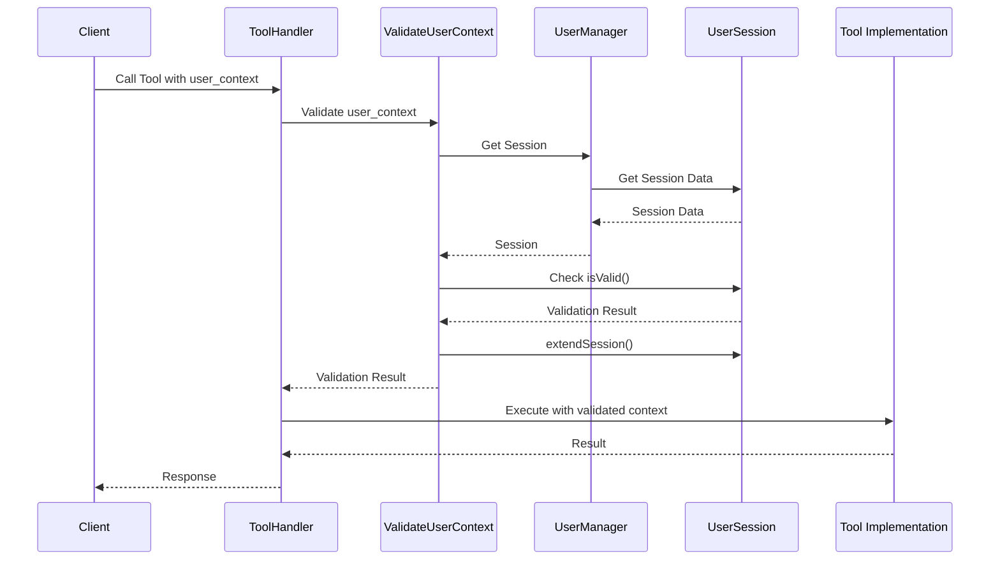
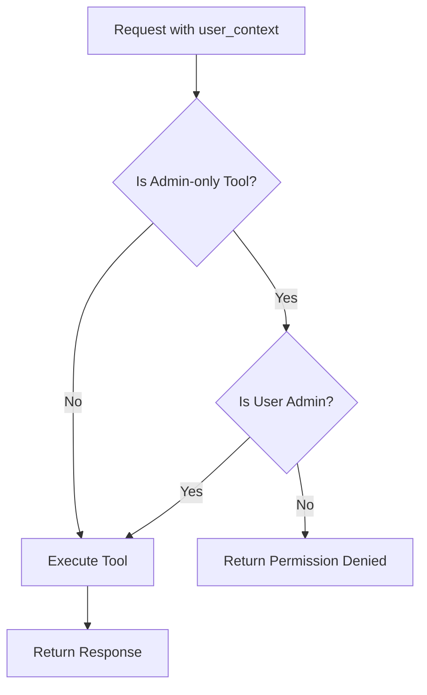
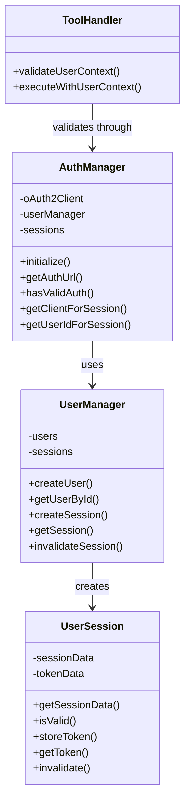
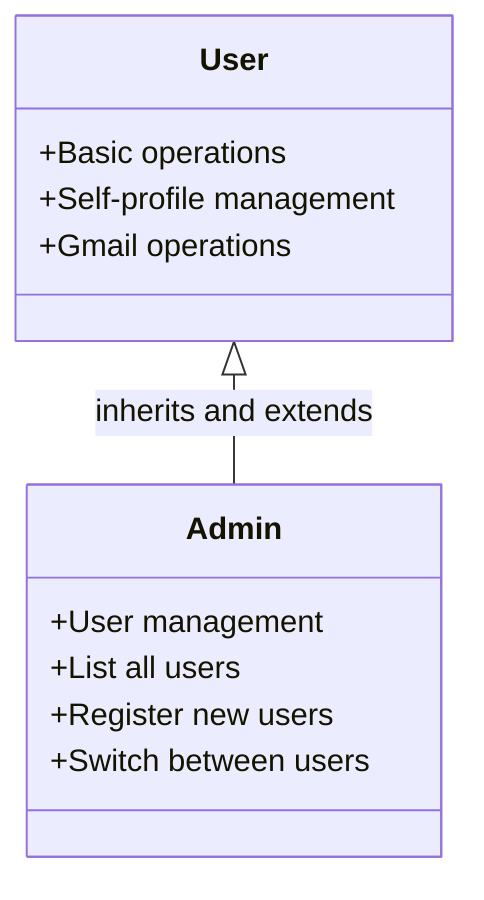
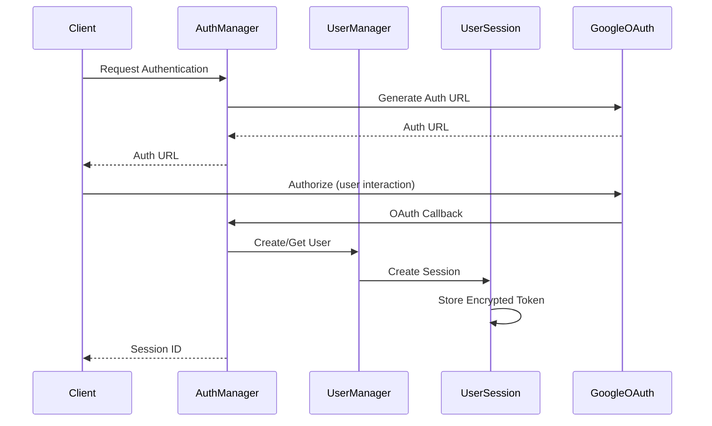

# Multi-User Authentication Architecture

## Table of Contents
1. [Overall Architecture](#overall-architecture)
2. [User Context Propagation Flow](#user-context-propagation-flow)
3. [Role-Based Access Control Model](#role-based-access-control-model)
4. [Component Interactions](#component-interactions)
5. [Security Considerations](#security-considerations)
6. [API Interface](#api-interface)
7. [Integration Guidelines](#integration-guidelines)
8. [Future Security Enhancements](#future-security-enhancements)

## Overall Architecture

### System Overview

The Gmail MCP Server implements a comprehensive multi-user authentication system that enables multiple users to securely access Gmail resources through individual authentication sessions. The system supports OAuth2-based authentication with Google, secure token storage, role-based access control, and session management.

The authentication architecture is designed with the following key principles:

- **User Isolation**: Each user's data and operations are completely isolated from other users
- **Session Management**: Secure session creation, validation, and expiration
- **Role-Based Access**: Different permission levels for regular users and administrators
- **Secure Token Storage**: Encrypted storage of sensitive OAuth tokens
- **Backward Compatibility**: Support for legacy single-user mode

### Core Components

The multi-user authentication system consists of three primary components:

1. **AuthManager**: Handles OAuth2 authentication with Google and serves as the main interface for authentication operations
2. **UserManager**: Manages user profiles, sessions, and user-related operations
3. **UserSession**: Represents an authenticated user session, including token storage and validation

### Authentication Flow

The authentication process follows these steps:

1. Client requests authentication with optional scopes
2. AuthManager generates an authentication URL for Google OAuth
3. User completes OAuth flow in a browser
4. OAuth callback is received and processed
5. User profile is created or retrieved
6. Session is created for the user
7. OAuth token is securely stored
8. Session ID is returned to the client for future requests

### Session Management

Sessions are created upon successful authentication and have the following properties:

- Each session has a unique ID
- Sessions have an expiration time (default: 24 hours)
- Sessions are extended when used
- Invalid or expired sessions are automatically rejected
- Sessions can be manually invalidated by users or administrators

### Data Storage

User and authentication data is stored as follows:

- **User Profiles**: Stored as JSON files in the configured storage path
- **OAuth Tokens**: Encrypted and stored in separate files
- **Session Data**: Held in memory with reference to stored tokens

## User Context Propagation Flow

### User Context Structure

The UserContext interface defines the structure of user context information that must be included with each API request:

```typescript
export interface UserContext {
  user_id: string;   // Unique identifier for the user
  session_id: string; // Session ID from authentication
}
```

This context provides the necessary information to validate the user's identity and permissions for each operation.

### Context Propagation in API Calls

For each tool call to the system, the client must include the user context in the request parameters:

```json
{
  "tool_name": "example_tool",
  "args": {
    "param1": "value1",
    "param2": "value2",
    "user_context": {
      "user_id": "user-uuid-here",
      "session_id": "session-uuid-here"
    }
  }
}
```

The tool handler extracts and validates this context before executing the requested operation.

### Validation Process

The validation process occurs in the `validateUserContext` function:

1. Check if user context is present and contains required fields
2. Retrieve the session using the session ID
3. Verify that the session exists
4. Verify that the session belongs to the specified user
5. Verify that the session is still valid (not expired)
6. Extend the session validity period
7. Allow the operation to proceed if all checks pass

Here's the validation flow:



### Session Verification

Sessions are verified before every operation to ensure:

1. The session exists in the system
2. The session has not been manually invalidated
3. The session has not expired
4. The session belongs to the specified user

### Session Extension

When a valid session is used, its expiration time is automatically extended:

```typescript
extendSession(durationMs = this.SESSION_DURATION_MS): void {
  if (!this.isValid()) {
    throw new Error('Cannot extend an invalid session');
  }

  this.sessionData.expires = new Date(Date.now() + durationMs);
  logger.debug(`Session ${this.sessionData.sessionId} extended to ${this.sessionData.expires}`);
}
```

This ensures that active users maintain their sessions while inactive sessions expire appropriately.

### Error Handling

Authentication errors are properly handled and reported:

- **Missing Context**: Returns an InvalidParams error
- **Invalid Session**: Returns an InvalidRequest error
- **Permission Denied**: Returns a PermissionDenied error
- **Expired Session**: Returns an InvalidRequest error

## Role-Based Access Control Model

### User Roles

The system supports two primary roles:

1. **User**: Regular users who can access their own data and perform standard operations
2. **Admin**: Administrative users who can manage other users and perform system-level operations

Roles are stored in the UserProfile:

```typescript
export interface UserProfile {
  userId: string;
  email: string;
  displayName?: string;
  profilePicture?: string;
  created: Date;
  lastLogin?: Date;
  role?: 'user' | 'admin';
  preferences: {
    // user preferences...
  };
  isActive: boolean;
}
```

### Role Assignment

Roles are assigned as follows:

- The first user registered in the system is automatically assigned the 'admin' role
- Subsequent users are assigned the 'user' role by default
- Only administrators can change user roles

### Permission Enforcement

Permissions are enforced at the tool handler level:



The system verifies that the user has appropriate permissions for each requested operation.

### Admin Privileges

Administrators have the following exclusive capabilities:

- List all users in the system
- Register new users (after the first user)
- Manage other users' profiles
- Switch between user contexts
- Deactivate user accounts

### Regular User Permissions

Regular users can:

- Manage their own profile
- Create and use their own sessions
- Access Gmail operations with their own credentials
- Perform standard email operations (search, categorize, etc.)

### Permission Check Implementation

Permission checks are implemented in each tool handler function that requires elevated privileges:

```typescript
// Example permission check for admin-only function
const requestingUser = context.userManager.getUserById(args.user_context.user_id);
if (!requestingUser || requestingUser.role !== 'admin') {
  throw new McpError(
    ErrorCode.InvalidRequest,
    'Only administrators can perform this operation.'
  );
}
```

## Component Interactions

### Class Relationships

The authentication components interact as follows:



### Role Inheritance

User roles follow this inheritance pattern:



### Tool Integration

The authentication system integrates with the tool handler system through:

1. User context validation before tool execution
2. Permission checks for restricted operations
3. OAuth client creation for authenticated requests to Google APIs

### API Client Integration

OAuth clients are created for each user session:

1. The `getClientForSession` method retrieves or creates an OAuth client for a specific session
2. The client is configured with the user's stored tokens
3. Token refresh is handled automatically when needed
4. The configured client is used for Gmail API requests

## Security Considerations

### Token Encryption

OAuth tokens are encrypted before storage:

1. A unique encryption key is generated for the system
2. AES-256-CBC encryption is used for token data
3. The initialization vector (IV) is stored with the encrypted data
4. Tokens are stored in separate files per user

The encryption process:

```typescript
private encryptData(data: string): string {
  const iv = crypto.randomBytes(16);
  const key = crypto.createHash('sha256').update(this.TOKEN_ENCRYPTION_KEY).digest('base64').substring(0, 32);
  const cipher = crypto.createCipheriv('aes-256-cbc', key, iv);
  
  let encrypted = cipher.update(data, 'utf8', 'hex');
  encrypted += cipher.final('hex');
  
  // Return IV + encrypted data
  return iv.toString('hex') + ':' + encrypted;
}
```

### Session Validation

Sessions are validated at multiple levels:

1. Session existence check
2. Session ownership verification
3. Session expiration check
4. Session validity flag check

All operations require a valid session, with the exception of initial authentication.

### Session Expiration

Sessions expire automatically:

1. Default session duration is 24 hours
2. Sessions are extended with each use
3. Expired sessions are rejected
4. Expired sessions are cleaned up periodically

### Secure Callbacks

OAuth callbacks are handled securely:

1. State parameters protect against CSRF attacks
2. Callback verification ensures the request matches a pending authentication
3. Successful authentication immediately closes the callback server
4. Tokens are immediately encrypted and stored

### Permission Boundaries

The system enforces strict permission boundaries:

1. Users can only access their own data
2. Only admins can access user management functions
3. Session ownership is verified before any operation
4. User isolation is maintained throughout all operations

## API Interface

### User Context Parameter

The user context parameter structure:

```typescript
{
  "user_id": "user-uuid-here",
  "session_id": "session-uuid-here"
}
```

This must be included in all API calls except initial authentication.

### Authentication Endpoints

The authentication system provides these primary endpoints:

1. **authenticate**: Initiates OAuth flow for a user
2. **register_user**: Registers a new user in the system
3. **get_user_profile**: Retrieves a user's profile information
4. **switch_user**: Switches between user contexts (admin only)
5. **list_users**: Lists all users in the system (admin only)

### Session Management Endpoints

Although not exposed directly as tools, these operations are available through the API:

1. Session creation (part of authentication)
2. Session validation (automatic with each request)
3. Session extension (automatic with each request)
4. Session invalidation (through user logout)

### Authentication Flow

The complete authentication flow:



## Integration Guidelines

### Consuming User Context

Modules should consume user context as follows:

1. Accept user context parameter in function calls
2. Validate the context before performing any operations
3. Use the validated user ID for database queries and operations
4. Maintain user isolation by filtering data based on user ID

### Best Practices

1. **Always validate user context**: Every operation (except authentication) must validate user context
2. **Use the validateUserContext function**: Use the centralized validation function
3. **Include permission checks**: Add explicit permission checks for restricted operations
4. **Extend sessions appropriately**: Sessions are automatically extended on use
5. **Handle auth errors gracefully**: Present clear error messages for authentication issues

### Backward Compatibility

The system maintains backward compatibility with the legacy single-user mode:

1. The AuthManager can operate in either multi-user or single-user mode
2. Legacy paths and configurations are still supported
3. Single-user mode uses simplified authentication without user isolation

## Future Security Enhancements

### Recommended Security Improvements

1. **Multi-Factor Authentication (MFA)**
   - Implement time-based one-time password (TOTP) for additional login security
   - Support for hardware security keys (U2F/WebAuthn)
   - Risk-based authentication requiring MFA for sensitive operations

2. **Enhanced Session Management**
   - IP-based session binding to prevent session hijacking
   - User agent validation for suspicious access detection
   - Concurrent session limitations with visibility of active sessions

3. **Advanced Access Control**
   - Fine-grained permission model beyond simple user/admin roles
   - Custom roles with configurable permissions
   - Resource-based access control for shared resources

4. **Security Auditing**
   - Comprehensive audit logging of authentication events
   - Login attempt monitoring with brute-force protection
   - User activity timeline for security investigations

5. **Token Security Enhancements**
   - Hardware Security Module (HSM) integration for token encryption
   - Automatic token rotation policies
   - Token usage analytics to detect abnormal patterns

6. **API Security**
   - API rate limiting per user/session
   - JWT-based authentication option for service integrations
   - OAuth2 scope restrictions based on user roles

7. **Compliance Features**
   - GDPR compliance tools for user data management
   - Configurable password policies and expiration
   - Session timeout controls based on organizational policies

### Implementation Priorities

The recommended implementation order based on security impact:

1. Enhanced session management features
2. Security auditing implementation
3. Multi-factor authentication
4. Advanced access control model
5. Token security enhancements
6. API security improvements
7. Compliance features