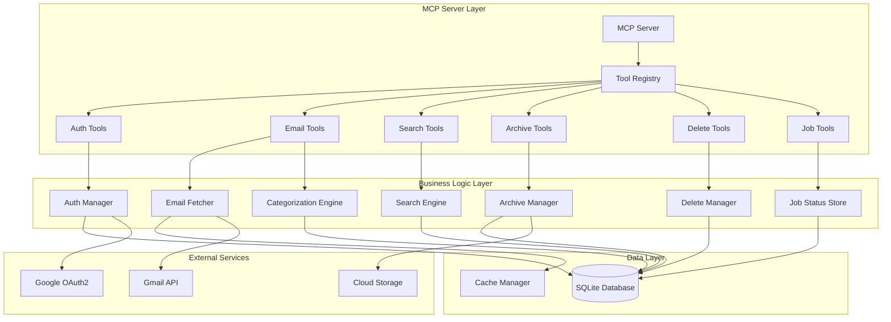

# Gmail MCP Server

[](https://nodejs.org/)
[](https://opensource.org/licenses/MIT)
[](https://modelcontextprotocol.io/)
[](https://www.typescriptlang.org/)

A comprehensive Model Context Protocol (MCP) server that integrates with Gmail API to provide intelligent email management capabilities. Features advanced email categorization, search, archiving, deletion, and automated cleanup with 25+ MCP tools for complete email lifecycle management.

## 🚀 Key Features

### 📧 **Intelligent Email Management**
- **AI-Powered Categorization**: Automatically categorize emails by importance (high/medium/low) using advanced analysis
- **Smart Search & Filtering**: Advanced search with multiple criteria, saved searches, and filter combinations
- **Real-time Processing**: Background job processing for long-running operations with progress tracking

### 🗄️ **Archive & Export System**
- **Smart Archiving**: Archive emails based on rules with multiple export formats (MBOX, JSON, CSV)
- **Automated Rules Engine**: Create and manage automatic archiving rules with scheduling
- **Restore Capability**: Restore previously archived emails with full metadata

### 🧹 **Advanced Cleanup Automation**
- **Policy-Based Cleanup**: 13+ cleanup tools with configurable policies for automated email management
- **Access Pattern Tracking**: Track email access patterns for intelligent cleanup decisions
- **Safety-First Design**: Dry-run options, confirmation steps, and rollback capabilities

### 📊 **Analytics & Monitoring**
- **Comprehensive Statistics**: Detailed email usage analytics by category, year, size, and more
- **System Health Monitoring**: Real-time metrics, performance tracking, and system health reports
- **Cleanup Recommendations**: AI-driven recommendations for optimal email management

### 🔒 **Security & Safety**
- **OAuth2 Authentication**: Secure Gmail API integration with encrypted token storage
- **Multi-layered Safety**: Confirmation prompts, dry-run modes, and maximum deletion limits
- **Audit Logging**: Complete operation logging and error tracking

## 📋 Table of Contents

- [🚀 Quick Start](#-quick-start)
- [📦 Installation](#-installation)
- [🔧 Configuration](#-configuration)
- [🛠️ MCP Tools Reference](#️-mcp-tools-reference)
  - [🔐 Authentication Tools](#-authentication-tools)
  - [📧 Email Management Tools](#-email-management-tools)
  - [🔍 Search & Filter Tools](#-search--filter-tools)
  - [📁 Archive & Export Tools](#-archive--export-tools)
  - [🗑️ Delete & Cleanup Tools](#️-delete--cleanup-tools)
  - [📊 Statistics & Analytics Tools](#-statistics--analytics-tools)
  - [⚙️ Job Management Tools](#️-job-management-tools)
- [🏗️ Architecture Overview](#️-architecture-overview)
- [🔧 Development & Contributing](#-development--contributing)
- [📚 Example Workflows](#-example-workflows)
- [🔒 Security & Safety](#-security--safety)
- [❓ Troubleshooting](#-troubleshooting)

## 🚀 Quick Start

### Prerequisites
- **Node.js** 18+ and npm
- **Google Cloud Platform** account with Gmail API enabled
- **OAuth2 credentials** (Client ID and Client Secret)

### Automated Setup
```bash
# Clone and install
git clone <repository-url>
cd gmail-mcp-server
npm run setup  # Interactive setup wizard
npm install && npm run build
```

### First Run
```bash
# Start the MCP server
npm start

# Authenticate with Gmail (run in your MCP client)
{
  "tool": "authenticate"
}
```

## 📦 Installation

### Method 1: Quick Setup (Recommended)
```bash
# 1. Clone repository
git clone <repository-url>
cd gmail-mcp-server

# 2. Run interactive setup
npm run setup

# 3. Install and build
npm install
npm run build
```

The setup script will guide you through:
- 🔑 Setting up Google Cloud credentials
- 📁 Creating necessary directories
- ⚙️ Configuring environment variables
- 🔧 Initial configuration

### Method 2: Manual Setup

1. **Set up Google Cloud credentials:**
   - Go to [Google Cloud Console](https://console.cloud.google.com)
   - Create project or select existing
   - Enable Gmail API
   - Create OAuth2 credentials (Desktop application)
   - Download `credentials.json` to project root

2. **Configure environment:**
   ```bash
   cp .env.example .env
   # Edit .env with your settings
   ```

3. **Create directories:**
   ```bash
   mkdir -p data logs archives
   ```

4. **Install and build:**
   ```bash
   npm install
   npm run build
   ```

## 🔧 Configuration

### MCP Client Setup

**For Claude Desktop:**
```json
{
  "mcpServers": {
    "gmail": {
      "command": "node",
      "args": ["/path/to/gmail-mcp-server/build/index.js"],
      "env": {
        "NODE_ENV": "production"
      }
    }
  }
}
```

**For other MCP clients:**
```bash
# Direct stdio connection
node /path/to/gmail-mcp-server/build/index.js
```

### Environment Configuration
Key environment variables in `.env`:
```env
GOOGLE_CLIENT_ID=your_client_id
GOOGLE_CLIENT_SECRET=your_client_secret
GOOGLE_REDIRECT_URI=http://localhost:3000/oauth2callback
STORAGE_PATH=./data
CACHE_TTL=3600
LOG_LEVEL=info
```

## 🛠️ MCP Tools Reference

The Gmail MCP Server provides **25+ specialized tools** organized into logical categories for comprehensive email management. Each tool includes safety features, parameter validation, and detailed error handling.

### 🔐 Authentication Tools

#### `authenticate`
Initiates OAuth2 authentication flow with Gmail API.

**Parameters:**
- `scopes` (array, optional): Additional OAuth scopes beyond Gmail read/write

**Returns:** Authentication status and user email

```json
{
  "tool": "authenticate",
  "arguments": {
    "scopes": ["https://www.googleapis.com/auth/gmail.modify"]
  }
}
```

---

### 📧 Email Management Tools

#### `list_emails`
List emails with comprehensive filtering and pagination.

**Parameters:**
- `category` (string): Filter by importance level (`high`|`medium`|`low`)
- `year` (number): Filter by specific year
- `size_min` (number): Minimum size in bytes
- `size_max` (number): Maximum size in bytes
- `archived` (boolean): Include archived emails
- `has_attachments` (boolean): Filter by attachment presence
- `labels` (array): Filter by Gmail labels
- `query` (string): Custom Gmail query string
- `limit` (number, default: 50): Maximum results
- `offset` (number, default: 0): Skip first N results

```json
{
  "tool": "list_emails",
  "arguments": {
    "category": "high",
    "year": 2024,
    "has_attachments": true,
    "limit": 25
  }
}
```

#### `get_email_details`
Retrieve complete email content and metadata.

**Parameters:**
- `id` (string, required): Gmail message ID

**Returns:** Full email object with headers, body, attachments

```json
{
  "tool": "get_email_details",
  "arguments": {
    "id": "18c2e4f5d9a8b7c3"
  }
}
```

#### `categorize_emails`
Analyze and categorize emails by importance using AI algorithms.

**Parameters:**
- `year` (number, required): Year to categorize
- `force_refresh` (boolean): Re-analyze already categorized emails

**Returns:** Categorization job status and statistics

```json
{
  "tool": "categorize_emails",
  "arguments": {
    "year": 2024,
    "force_refresh": true
  }
}
```

---

### 🔍 Search & Filter Tools

#### `search_emails`
Advanced multi-criteria email search with intelligent filtering.

**Parameters:**
- `query` (string): Text search query
- `category` (string): Importance filter (`high`|`medium`|`low`)
- `year_range` (object): Date range with `start` and/or `end` year
- `size_range` (object): Size range with `min` and/or `max` bytes
- `sender` (string): Filter by sender email address
- `has_attachments` (boolean): Attachment presence filter
- `archived` (boolean): Include archived emails
- `limit` (number, default: 50): Maximum results

```json
{
  "tool": "search_emails",
  "arguments": {
    "query": "project deadline",
    "category": "high",
    "year_range": { "start": 2024 },
    "size_range": { "min": 1048576 },
    "sender": "manager@company.com"
  }
}
```

#### `save_search`
Save search criteria for quick reuse.

**Parameters:**
- `name` (string, required): Name for saved search
- `criteria` (object, required): Search criteria to save

```json
{
  "tool": "save_search",
  "arguments": {
    "name": "Large Recent Emails",
    "criteria": {
      "size_range": { "min": 5242880 },
      "year_range": { "start": 2024 }
    }
  }
}
```

#### `list_saved_searches`
Retrieve all saved search queries.

**Parameters:** None

**Returns:** Array of saved searches with usage statistics

```json
{
  "tool": "list_saved_searches"
}
```

---

### 📁 Archive & Export Tools

#### `archive_emails`
Archive emails using multiple methods and formats.

**Parameters:**
- `search_criteria` (object): Email selection criteria
- `category` (string): Archive by importance level
- `year` (number): Archive emails from specific year
- `older_than_days` (number): Archive emails older than N days
- `method` (string, required): Archive method (`gmail`|`export`)
- `export_format` (string): Format when exporting (`mbox`|`json`)
- `export_path` (string): Custom export destination
- `dry_run` (boolean, default: false): Preview mode

```json
{
  "tool": "archive_emails",
  "arguments": {
    "category": "low",
    "older_than_days": 180,
    "method": "export",
    "export_format": "mbox",
    "dry_run": false
  }
}
```

#### `restore_emails`
Restore emails from previous archives.

**Parameters:**
- `archive_id` (string): Specific archive to restore from
- `email_ids` (array): Individual email IDs to restore
- `restore_labels` (array): Labels to apply to restored emails

```json
{
  "tool": "restore_emails",
  "arguments": {
    "archive_id": "archive_2023_low_priority",
    "restore_labels": ["restored", "reviewed"]
  }
}
```

#### `create_archive_rule`
Create automated archiving rules with scheduling.

**Parameters:**
- `name` (string, required): Descriptive rule name
- `criteria` (object, required): Archiving conditions
- `action` (object, required): Archive method and format
- `schedule` (string): Execution frequency (`daily`|`weekly`|`monthly`)

```json
{
  "tool": "create_archive_rule",
  "arguments": {
    "name": "Auto-archive old promotional emails",
    "criteria": {
      "category": "low",
      "older_than_days": 90,
      "labels": ["promotions"]
    },
    "action": {
      "method": "gmail"
    },
    "schedule": "weekly"
  }
}
```

#### `list_archive_rules`
View all configured archive rules and their status.

**Parameters:**
- `active_only` (boolean, default: false): Show only enabled rules

```json
{
  "tool": "list_archive_rules",
  "arguments": {
    "active_only": true
  }
}
```

#### `export_emails`
Export emails to external formats with cloud upload support.

**Parameters:**
- `search_criteria` (object): Email selection filters
- `format` (string, required): Export format (`mbox`|`json`|`csv`)
- `include_attachments` (boolean, default: false): Include attachments
- `output_path` (string): Local output path
- `cloud_upload` (object): Cloud storage configuration

```json
{
  "tool": "export_emails",
  "arguments": {
    "format": "json",
    "search_criteria": { "year": 2023 },
    "include_attachments": true,
    "cloud_upload": {
      "provider": "gdrive",
      "path": "/backups/gmail-2023"
    }
  }
}
```

---

### 🗑️ Delete & Cleanup Tools

#### `delete_emails`
Safely delete emails with comprehensive safety checks.

⚠️ **Safety Note:** Always use `dry_run: true` first to preview deletions

**Parameters:**
- `search_criteria` (object): Email selection filters
- `category` (string): Delete by importance level
- `year` (number): Delete from specific year
- `size_threshold` (number): Delete emails larger than N bytes
- `skip_archived` (boolean, default: true): Skip archived emails
- `dry_run` (boolean, default: false): Preview mode
- `max_count` (number, default: 10): Safety limit

```json
{
  "tool": "delete_emails",
  "arguments": {
    "category": "low",
    "year": 2022,
    "dry_run": true,
    "max_count": 50
  }
}
```

#### `empty_trash`
Permanently delete all emails in Gmail trash folder.

⚠️ **Destructive Operation:** This permanently deletes emails

**Parameters:**
- `dry_run` (boolean, default: false): Preview mode
- `max_count` (number, default: 10): Safety limit

```json
{
  "tool": "empty_trash",
  "arguments": {
    "dry_run": true,
    "max_count": 100
  }
}
```

#### `trigger_cleanup`
Execute manual cleanup using specific policies.

**Parameters:**
- `policy_id` (string, required): Cleanup policy to execute
- `dry_run` (boolean, default: false): Preview mode
- `max_emails` (number): Processing limit
- `force` (boolean, default: false): Execute even if policy disabled

```json
{
  "tool": "trigger_cleanup",
  "arguments": {
    "policy_id": "old_low_priority_emails",
    "dry_run": true,
    "max_emails": 500
  }
}
```

#### `get_cleanup_status`
Monitor cleanup automation system status.

**Parameters:** None

**Returns:** System status, active jobs, and health metrics

```json
{
  "tool": "get_cleanup_status"
}
```

#### `get_system_health`
Get comprehensive system health and performance metrics.

**Parameters:** None

**Returns:** Performance metrics, storage usage, and system status

```json
{
  "tool": "get_system_health"
}
```

#### `create_cleanup_policy`
Create advanced cleanup policies with detailed criteria.

**Parameters:**
- `name` (string, required): Policy name
- `enabled` (boolean, default: true): Policy status
- `priority` (number, default: 50): Execution priority (0-100)
- `criteria` (object, required): Cleanup conditions
- `action` (object, required): Action to take
- `safety` (object, required): Safety configuration
- `schedule` (object): Optional scheduling

```json
{
  "tool": "create_cleanup_policy",
  "arguments": {
    "name": "Aggressive Low Priority Cleanup",
    "priority": 80,
    "criteria": {
      "age_days_min": 90,
      "importance_level_max": "low",
      "spam_score_min": 0.7
    },
    "action": {
      "type": "delete"
    },
    "safety": {
      "max_emails_per_run": 100,
      "require_confirmation": false,
      "dry_run_first": true
    }
  }
}
```

#### `update_cleanup_policy`
Modify existing cleanup policy configuration.

**Parameters:**
- `policy_id` (string, required): Policy to update
- `updates` (object, required): Changes to apply

```json
{
  "tool": "update_cleanup_policy",
  "arguments": {
    "policy_id": "policy_123",
    "updates": {
      "enabled": false,
      "safety": { "max_emails_per_run": 50 }
    }
  }
}
```

#### `list_cleanup_policies`
View all cleanup policies and their configurations.

**Parameters:**
- `active_only` (boolean, default: false): Show only enabled policies

```json
{
  "tool": "list_cleanup_policies",
  "arguments": {
    "active_only": true
  }
}
```

#### `delete_cleanup_policy`
Remove a cleanup policy permanently.

**Parameters:**
- `policy_id` (string, required): Policy to delete

```json
{
  "tool": "delete_cleanup_policy",
  "arguments": {
    "policy_id": "outdated_policy_456"
  }
}
```

#### `create_cleanup_schedule`
Schedule automatic cleanup policy execution.

**Parameters:**
- `name` (string, required): Schedule name
- `type` (string, required): Schedule type (`daily`|`weekly`|`monthly`|`interval`|`cron`)
- `expression` (string, required): Schedule expression
- `policy_id` (string, required): Policy to schedule
- `enabled` (boolean, default: true): Schedule status

```json
{
  "tool": "create_cleanup_schedule",
  "arguments": {
    "name": "Nightly Low Priority Cleanup",
    "type": "daily",
    "expression": "02:00",
    "policy_id": "low_priority_policy",
    "enabled": true
  }
}
```

#### `update_cleanup_automation_config`
Update global cleanup automation settings.

**Parameters:**
- `config` (object, required): Configuration updates

```json
{
  "tool": "update_cleanup_automation_config",
  "arguments": {
    "config": {
      "continuous_cleanup": {
        "enabled": true,
        "target_emails_per_minute": 10
      }
    }
  }
}
```

#### `get_cleanup_metrics`
Retrieve cleanup system analytics and performance data.

**Parameters:**
- `hours` (number, default: 24): History window in hours

```json
{
  "tool": "get_cleanup_metrics",
  "arguments": {
    "hours": 168
  }
}
```

#### `get_cleanup_recommendations`
Get AI-powered cleanup policy recommendations.

**Parameters:** None

**Returns:** Recommended policies based on email analysis

```json
{
  "tool": "get_cleanup_recommendations"
}
```

---

### 📊 Statistics & Analytics Tools

#### `get_email_stats`
Comprehensive email usage statistics and analytics.

**Parameters:**
- `group_by` (string): Grouping method (`year`|`category`|`label`|`all`)
- `year` (number): Filter by specific year

**Returns:** Detailed statistics by categories, years, sizes, and storage

```json
{
  "tool": "get_email_stats",
  "arguments": {
    "group_by": "all"
  }
}
```

---

### ⚙️ Job Management Tools

#### `list_jobs`
View all background jobs with filtering options.

**Parameters:**
- `limit` (number, default: 50): Maximum results
- `offset` (number, default: 0): Skip first N jobs
- `status` (string): Filter by status (`pending`|`running`|`completed`|`failed`)
- `job_type` (string): Filter by job type

```json
{
  "tool": "list_jobs",
  "arguments": {
    "status": "running",
    "limit": 25
  }
}
```

#### `get_job_status`
Get detailed status of a specific background job.

**Parameters:**
- `id` (string, required): Job ID to query

**Returns:** Job details, progress, and results

```json
{
  "tool": "get_job_status",
  "arguments": {
    "id": "categorization_job_789"
  }
}
```

#### `cancel_job`
Cancel a running background job.

**Parameters:**
- `id` (string, required): Job ID to cancel

```json
{
  "tool": "cancel_job",
  "arguments": {
    "id": "cleanup_job_101112"
  }
}
```

## Example Workflows

### Initial Setup
```json
// 1. Authenticate
{
  "tool": "authenticate"
}

// 2. Categorize all emails
{
  "tool": "categorize_emails",
  "arguments": {
    "force_refresh": true
  }
}

// 3. View statistics
{
  "tool": "get_email_stats",
  "arguments": {
    "group_by": "all"
  }
}
```

### Clean Up Old Emails
```json
// 1. Search for old large emails
{
  "tool": "search_emails",
  "arguments": {
    "year_range": { "end": 2022 },
    "size_range": { "min": 5242880 }
  }
}

// 2. Archive them
{
  "tool": "archive_emails",
  "arguments": {
    "year": 2022,
    "size_threshold": 5242880,
    "method": "export",
    "export_format": "mbox"
  }
}
```

### Automated Cleanup Setup
```json
// 1. Start cleanup automation [TODO]
{
  "tool": "start_cleanup_automation",
  "arguments": {
    "policies": ["old_emails", "large_attachments"],
    "schedule": "daily"
  }
}

// 2. Monitor cleanup status
{
  "tool": "get_cleanup_status"
}
```

## Development

### Project Structure
```
gmail-mcp-server/
├── src/
│   ├── auth/           # Authentication management
│   ├── cache/          # Caching layer
│   ├── categorization/ # Email categorization engine
│   ├── cleanup/        # Cleanup automation
│   ├── database/       # SQLite database management
│   ├── delete/         # Email deletion logic
│   ├── email/          # Email fetching and processing
│   ├── search/         # Search functionality
│   ├── archive/        # Archive management
│   ├── tools/          # MCP tool definitions
│   ├── types/          # TypeScript type definitions
│   └── utils/          # Utility functions
├── build/              # Compiled JavaScript
├── data/               # Local storage
├── logs/               # Application logs
└── archives/           # Email archives
```

### Running in Development
```bash
npm run watch  # Watch mode for TypeScript
npm run dev    # Run with tsx (hot reload)
```

### Testing with MCP Inspector
```bash
npm run inspector
```

## Testing

The project includes comprehensive test suites to ensure reliability and correctness of all features.

### Running Tests
```bash
# Run all tests
npm test

# Run with coverage
npm test -- --coverage

# Run specific test suite
npm test -- --testPathPattern=delete
```

### Integration Tests

#### Delete Email Tests
The delete functionality has extensive integration tests covering all scenarios:

```bash
# Run delete integration tests with the dedicated runner
node scripts/test-delete-integration.js

# With coverage report
node scripts/test-delete-integration.js --coverage

# Run specific test scenarios
node scripts/test-delete-integration.js --filter "delete by category"
```

For detailed information about delete email testing, see [Delete Email Testing Documentation](docs/DELETE_EMAIL_TESTING.md).

### Test Structure
```
tests/
├── unit/               # Unit tests for individual components
├── integration/        # Integration tests for complete features
│   └── delete/        # Delete email integration tests
├── fixtures/          # Shared test data
└── setup.ts          # Test environment setup
```

### Writing Tests
- Follow the existing test patterns
- Use descriptive test names
- Mock external dependencies
- Test both success and error cases
- Maintain test coverage above 80%

## Security

- OAuth2 tokens are encrypted at rest
- All bulk operations require confirmation
- Audit logging for all operations
- Rate limiting implemented for Gmail API
- Access pattern tracking for security monitoring

## Troubleshooting

### Authentication Issues
- Ensure credentials.json is in the correct location
- Check that Gmail API is enabled in GCP
- Verify redirect URI matches your configuration

### Performance
- First categorization may take time for large mailboxes
- Use pagination for large result sets
- Enable caching in production

## License

MIT

## Contributing

Contributions are welcome! Please read our contributing guidelines before submitting PRs.
## 🏗️ Architecture Overview

The Gmail MCP Server follows a modular, layered architecture designed for scalability, maintainability, and extensibility.

### Core Architecture



### Project Structure

```
gmail-mcp-server/
├── 📁 src/
│   ├── 🔐 auth/                    # OAuth2 authentication & token management
│   │   └── AuthManager.ts          # Core authentication logic
│   ├── 📧 email/                   # Email processing & fetching
│   │   └── EmailFetcher.ts         # Gmail API integration
│   ├── 🧠 categorization/          # AI-powered email categorization
│   │   ├── CategorizationEngine.ts # Main categorization logic
│   │   ├── CategorizationWorker.ts # Background processing
│   │   └── analyzers/              # Specialized analyzers
│   │       ├── ImportanceAnalyzer.ts
│   │       ├── DateSizeAnalyzer.ts
│   │       └── LabelClassifier.ts
│   ├── 🔍 search/                  # Advanced search functionality
│   │   └── SearchEngine.ts         # Multi-criteria search
│   ├── 📁 archive/                 # Email archiving & export
│   │   └── ArchiveManager.ts       # Archive operations
│   ├── 🗑️ delete/                  # Safe email deletion
│   │   └── DeleteManager.ts        # Deletion with safety checks
│   ├── 🧹 cleanup/                 # Automated cleanup system
│   │   ├── CleanupAutomationEngine.ts
│   │   ├── CleanupPolicyEngine.ts
│   │   ├── StalenessScorer.ts
│   │   └── SystemHealthMonitor.ts
│   ├── 🛠️ tools/                   # MCP tool definitions
│   │   ├── ToolRegistry.ts         # Tool registration system
│   │   ├── definitions/            # Tool definitions by category
│   │   └── base/                   # Tool builder utilities
│   ├── 💾 database/                # Data persistence
│   │   ├── DatabaseManager.ts      # SQLite management
│   │   └── JobStatusStore.ts       # Job tracking
│   ├── ⚡ cache/                   # Performance caching
│   │   └── CacheManager.ts         # In-memory & persistent cache
│   └── 📊 types/                   # TypeScript definitions
│       └── index.ts                # Comprehensive type system
├── 📁 tests/                       # Comprehensive test suite
│   ├── unit/                       # Unit tests
│   ├── integration/                # Integration tests
│   └── performance/                # Performance tests
├── 📁 docs/                        # Documentation
├── 📁 scripts/                     # Utility scripts
└── 📁 examples/                    # Usage examples
```

### Key Design Patterns

- **🔧 Modular Architecture**: Each component has a single responsibility
- **🏭 Factory Pattern**: Tool creation and configuration management
- **📦 Repository Pattern**: Data access abstraction
- **🔄 Observer Pattern**: Event-driven cleanup automation
- **🛡️ Strategy Pattern**: Multiple categorization algorithms
- **⚡ Caching Strategy**: Multi-level caching for performance

### Data Flow

1. **Authentication**: OAuth2 flow with secure token storage
2. **Email Fetching**: Batch processing with Gmail API rate limiting
3. **Categorization**: Multi-analyzer pipeline with ML-like scoring
4. **Search**: Indexed search with complex filter combinations
5. **Operations**: Safe execution with dry-run and confirmation steps

## 🔧 Development & Contributing

### Development Setup

```bash
# Clone and setup
git clone <repository-url>
cd gmail-mcp-server
npm install

# Development mode
npm run dev          # Hot reload with tsx
npm run watch        # TypeScript watch mode

# Testing
npm test            # Run all tests
npm run test:watch  # Watch mode testing
npm run inspector   # MCP Inspector for testing tools
```

### Development Workflow

1. **🌟 Feature Development**
   ```bash
   # Create feature branch
   git checkout -b feature/new-tool-name
   
   # Make changes
   # Add tests
   # Update documentation
   
   # Test thoroughly
   npm test
   npm run build
   ```

2. **🧪 Testing Strategy**
   - **Unit Tests**: Individual component testing
   - **Integration Tests**: End-to-end workflow testing
   - **Performance Tests**: Load and stress testing
   - **Manual Testing**: MCP Inspector validation

3. **📝 Documentation**
   - Update README.md for new tools
   - Add JSDoc comments for public APIs
   - Include usage examples
   - Update architecture diagrams

### Adding New MCP Tools

1. **Create Tool Definition**
   ```typescript
   // src/tools/definitions/my-category.tools.ts
   export const myToolConfigs: ToolConfig[] = [
     {
       name: 'my_new_tool',
       description: 'Description of what the tool does',
       category: 'my_category',
       parameters: {
         required_param: ParameterTypes.string('Required parameter'),
         optional_param: ParameterTypes.boolean('Optional parameter', false)
       },
       required: ['required_param']
     }
   ];
   ```

2. **Implement Tool Handler**
   ```typescript
   // src/tools/handlers/my-tool.handler.ts
   export async function handleMyNewTool(args: MyToolArgs): Promise<MyToolResult> {
     // Implementation
   }
   ```

3. **Register Tool**
   ```typescript
   // src/tools/definitions/index.ts
   import { myToolConfigs } from './my-category.tools.js';
   
   export function registerAllTools() {
     myToolConfigs.forEach(config => {
       toolRegistry.registerTool(ToolBuilder.fromConfig(config), config.category);
     });
   }
   ```

4. **Add Tests**
   ```typescript
   // tests/unit/tools/my-tool.test.ts
   describe('my_new_tool', () => {
     it('should handle valid input', async () => {
       // Test implementation
     });
   });
   ```

### Code Quality Standards

- **🔍 TypeScript**: Strict type checking with comprehensive interfaces
- **📏 ESLint**: Code style and quality enforcement
- **🎯 Testing**: >80% test coverage requirement
- **📚 Documentation**: JSDoc for all public APIs
- **🔒 Security**: Input validation and sanitization
- **⚡ Performance**: Efficient algorithms and caching

### Architecture Guidelines

- **🏗️ Separation of Concerns**: Each module has a single responsibility
- **🔌 Dependency Injection**: Loose coupling between components
- **📈 Scalability**: Designed for large email datasets
- **🛡️ Error Handling**: Comprehensive error handling and logging
- **🔄 Async Operations**: Non-blocking I/O with proper resource cleanup

### Contributing Guidelines

1. **🎯 Issues & Feature Requests**
   - Use issue templates
   - Provide detailed descriptions
   - Include use cases and examples

2. **💻 Pull Requests**
   - Follow PR template
   - Include tests and documentation
   - Ensure CI passes
   - Request reviews

3. **📋 Code Review Checklist**
   - ✅ Tests pass and coverage maintained
   - ✅ Documentation updated
   - ✅ Type safety maintained
   - ✅ Security considerations addressed
   - ✅ Performance implications considered

### Extension Points

The server is designed for extensibility:

- **🔧 Custom Tools**: Add domain-specific tools
- **🧠 Analyzers**: Implement custom categorization algorithms
- **📊 Exporters**: Add new export formats
- **🔍 Search Providers**: Integrate external search engines
- **☁️ Storage Backends**: Add cloud storage providers

## 📚 Example Workflows

### 🚀 Initial Setup & Email Organization

```json
// 1. Authenticate with Gmail
{
  "tool": "authenticate"
}

// 2. Get initial statistics
{
  "tool": "get_email_stats",
  "arguments": {
    "group_by": "all"
  }
}

// 3. Categorize all emails (this may take time for large mailboxes)
{
  "tool": "categorize_emails",
  "arguments": {
    "year": 2024,
    "force_refresh": false
  }
}

// 4. Review categorization results
{
  "tool": "list_emails",
  "arguments": {
    "category": "high",
    "limit": 20
  }
}
```

### 🧹 Advanced Cleanup Workflow

```json
// 1. Analyze old emails (dry run first)
{
  "tool": "search_emails",
  "arguments": {
    "year_range": { "end": 2022 },
    "size_range": { "min": 5242880 },
    "category": "low"
  }
}

// 2. Create archive rule for old large emails
{
  "tool": "create_archive_rule",
  "arguments": {
    "name": "Old Large Low Priority",
    "criteria": {
      "category": "low",
      "older_than_days": 365,
      "size_greater_than": 5242880
    },
    "action": {
      "method": "export",
      "export_format": "mbox"
    },
    "schedule": "monthly"
  }
}

// 3. Archive old emails (with dry run first)
{
  "tool": "archive_emails",
  "arguments": {
    "year": 2022,
    "category": "low",
    "method": "export",
    "export_format": "mbox",
    "dry_run": true
  }
}

// 4. Execute actual archival after reviewing dry run
{
  "tool": "archive_emails",
  "arguments": {
    "year": 2022,
    "category": "low",
    "method": "export",
    "export_format": "mbox",
    "dry_run": false
  }
}
```

### 🤖 Automated Cleanup Policy Setup

```json
// 1. Create aggressive cleanup policy for spam
{
  "tool": "create_cleanup_policy",
  "arguments": {
    "name": "Spam Cleanup",
    "priority": 90,
    "criteria": {
      "age_days_min": 30,
      "importance_level_max": "low",
      "spam_score_min": 0.8
    },
    "action": {
      "type": "delete"
    },
    "safety": {
      "max_emails_per_run": 200,
      "dry_run_first": true
    }
  }
}

// 2. Create moderate policy for old promotional emails
{
  "tool": "create_cleanup_policy",
  "arguments": {
    "name": "Old Promotions Archive",
    "priority": 50,
    "criteria": {
      "age_days_min": 90,
      "importance_level_max": "low",
      "promotional_score_min": 0.7
    },
    "action": {
      "type": "archive",
      "method": "gmail"
    },
    "safety": {
      "max_emails_per_run": 100
    }
  }
}

// 3. Schedule nightly cleanup
{
  "tool": "create_cleanup_schedule",
  "arguments": {
    "name": "Nightly Cleanup",
    "type": "daily",
    "expression": "02:00",
    "policy_id": "spam_cleanup_policy_id"
  }
}

// 4. Monitor cleanup status
{
  "tool": "get_cleanup_status"
}
```

### 🔍 Advanced Search & Analysis

```json
// 1. Save frequently used searches
{
  "tool": "save_search",
  "arguments": {
    "name": "Large Recent Important",
    "criteria": {
      "category": "high",
      "year_range": { "start": 2024 },
      "size_range": { "min": 1048576 }
    }
  }
}

// 2. Search for specific patterns
{
  "tool": "search_emails",
  "arguments": {
    "query": "invoice OR receipt OR payment",
    "category": "high",
    "year_range": { "start": 2023 },
    "has_attachments": true
  }
}

// 3. Export search results
{
  "tool": "export_emails",
  "arguments": {
    "search_criteria": {
      "query": "invoice OR receipt",
      "year_range": { "start": 2023 }
    },
    "format": "csv",
    "include_attachments": false
  }
}
```

### 📊 Analytics & Monitoring

```json
// 1. Get comprehensive statistics
{
  "tool": "get_email_stats",
  "arguments": {
    "group_by": "all"
  }
}

// 2. Monitor system health
{
  "tool": "get_system_health"
}

// 3. Get cleanup recommendations
{
  "tool": "get_cleanup_recommendations"
}

// 4. View cleanup metrics
{
  "tool": "get_cleanup_metrics",
  "arguments": {
    "hours": 168
  }
}
```

## 🔒 Security & Safety

### 🛡️ Authentication & Authorization

- **OAuth2 Flow**: Secure Google OAuth2 implementation
- **Token Encryption**: All tokens encrypted at rest using AES-256
- **Scope Limitation**: Minimal required Gmail API scopes
- **Token Rotation**: Automatic token refresh and rotation
- **Session Management**: Secure session handling with expiration

### 🔐 Data Protection

- **Local Storage**: Encrypted SQLite database for metadata
- **No Email Content Storage**: Only metadata stored locally
- **Audit Logging**: Comprehensive operation logging
- **Data Isolation**: User data completely isolated
- **Secure Communication**: HTTPS/TLS for all API communications

### ⚠️ Safety Mechanisms

1. **Dry Run Mode**: All destructive operations support preview mode
2. **Confirmation Prompts**: Multi-step confirmation for bulk operations
3. **Safety Limits**: Configurable maximum deletion/modification limits
4. **Backup Integration**: Automatic backup before major operations
5. **Rollback Capability**: Ability to restore from archives

### 🚨 Risk Mitigation

- **Rate Limiting**: Gmail API rate limit compliance
- **Error Handling**: Comprehensive error recovery
- **Validation**: Input sanitization and validation
- **Monitoring**: Real-time operation monitoring
- **Alerts**: Automatic alerts for critical issues

### 🔍 Security Best Practices

```json
// Always use dry run first for destructive operations
{
  "tool": "delete_emails",
  "arguments": {
    "category": "low",
    "dry_run": true  // ← Always start with dry run
  }
}

// Limit operations with max_count
{
  "tool": "empty_trash",
  "arguments": {
    "max_count": 50,  // ← Safety limit
    "dry_run": true
  }
}

// Use specific criteria instead of broad deletions
{
  "tool": "delete_emails",
  "arguments": {
    "year": 2022,           // ← Specific year
    "category": "low",      // ← Specific category
    "size_threshold": 10485760,  // ← Specific size
    "max_count": 100,       // ← Safety limit
    "dry_run": true
  }
}
```

## ❓ Troubleshooting

### 🔐 Authentication Issues

**Problem**: `Authentication failed` or `Invalid credentials`
```bash
# Solutions:
1. Verify credentials.json location (project root)
2. Check Gmail API is enabled in Google Cloud Console
3. Verify OAuth2 redirect URI matches configuration
4. Clear cached tokens: rm -rf data/tokens/
5. Re-run authentication: authenticate tool
```

**Problem**: `Token expired` errors
```bash
# Solutions:
1. Tokens auto-refresh, but if persistent:
2. Clear token cache: rm -rf data/tokens/
3. Re-authenticate: use authenticate tool
4. Check system clock is accurate
```

### 📧 Email Processing Issues

**Problem**: `Categorization taking too long`
```bash
# Solutions:
1. Use year-specific categorization:
   { "tool": "categorize_emails", "arguments": { "year": 2024 } }
2. Monitor progress:
   { "tool": "list_jobs", "arguments": { "status": "running" } }
3. Increase timeout in .env: CATEGORIZATION_TIMEOUT=300000
```

**Problem**: `Search results incomplete`
```bash
# Solutions:
1. Check Gmail API quota limits
2. Increase search limit: "limit": 500
3. Use pagination: "offset": 0, "limit": 100
4. Clear search cache: restart server
```

### 🗑️ Deletion & Cleanup Issues

**Problem**: `Deletion failed` or `Cleanup stuck`
```bash
# Solutions:
1. Always start with dry_run: true
2. Check job status: get_job_status
3. Cancel stuck jobs: cancel_job
4. Reduce max_count limits
5. Check Gmail API rate limits
```

**Problem**: `Archives not restoring`
```bash
# Solutions:
1. Check archive location exists
2. Verify archive format compatibility
3. Check available storage space
4. Use smaller batch sizes
```

### ⚡ Performance Issues

**Problem**: `Slow search or categorization`
```bash
# Solutions:
1. Enable caching: CACHE_ENABLED=true
2. Increase cache TTL: CACHE_TTL=7200
3. Use specific filters to reduce result sets
4. Consider database optimization: VACUUM
```

**Problem**: `High memory usage`
```bash
# Solutions:
1. Reduce batch sizes in operations
2. Clear cache periodically
3. Restart server regularly for large operations
4. Monitor with: get_system_health
```

### 📊 Database Issues

**Problem**: `Database locked` or `SQLite errors`
```bash
# Solutions:
1. Check for multiple server instances
2. Restart server to release locks
3. Check file permissions: data/ directory
4. Backup and recreate database if corrupted
```

### 🔧 Development Issues

**Problem**: `MCP Inspector not working`
```bash
# Solutions:
1. Install inspector: npm install -g @modelcontextprotocol/inspector
2. Build project first: npm run build
3. Run inspector: npm run inspector
4. Check server logs for errors
```

**Problem**: `TypeScript compilation errors`
```bash
# Solutions:
1. Clear build cache: rm -rf build/
2. Reinstall dependencies: npm ci
3. Check TypeScript version: npx tsc --version
4. Update dependencies: npm update
```

### 📞 Getting Help

- **📝 Documentation**: Check [`docs/`](docs/) directory for detailed guides
- **🐛 Issues**: Create detailed issue reports on GitHub
- **💬 Discussions**: Join community discussions
- **🔍 Debugging**: Enable debug logging: `LOG_LEVEL=debug`

### 🚨 Emergency Procedures

**If you accidentally delete important emails:**
1. Check Gmail Trash folder first
2. Use `restore_emails` if archived
3. Check local database for metadata
4. Contact Gmail support for account recovery

**If system is unresponsive:**
1. Cancel all running jobs: `cancel_job`
2. Restart server: `npm start`
3. Check system health: `get_system_health`
4. Clear caches if needed: `rm -rf data/cache/`

---

## 📄 License

MIT License - see [LICENSE](LICENSE) file for details.

## 🤝 Contributing

We welcome contributions! Please see our [Contributing Guidelines](CONTRIBUTING.md) for details on:

- 🐛 Bug reports and feature requests
- 💻 Code contributions and pull requests  
- 📚 Documentation improvements
- 🧪 Testing and quality assurance
- 🌍 Community support and discussions

---

<div align="center">

**⭐ Star this project if you find it useful!**

[](https://github.com/username/gmail-mcp-server)
[](https://x.com/kushalB22632020)
[](https://www.linkedin.com/in/kushal-bhattacharya1993/)

</div>