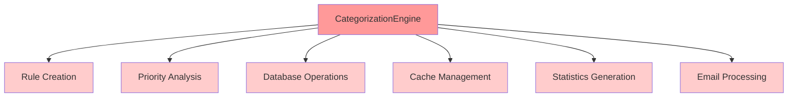
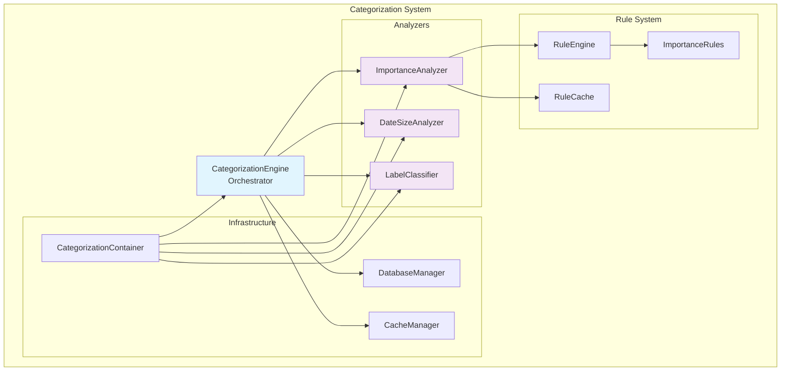
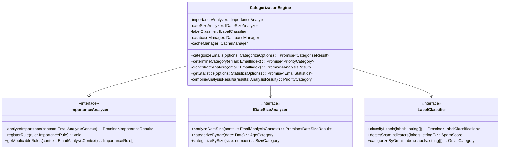
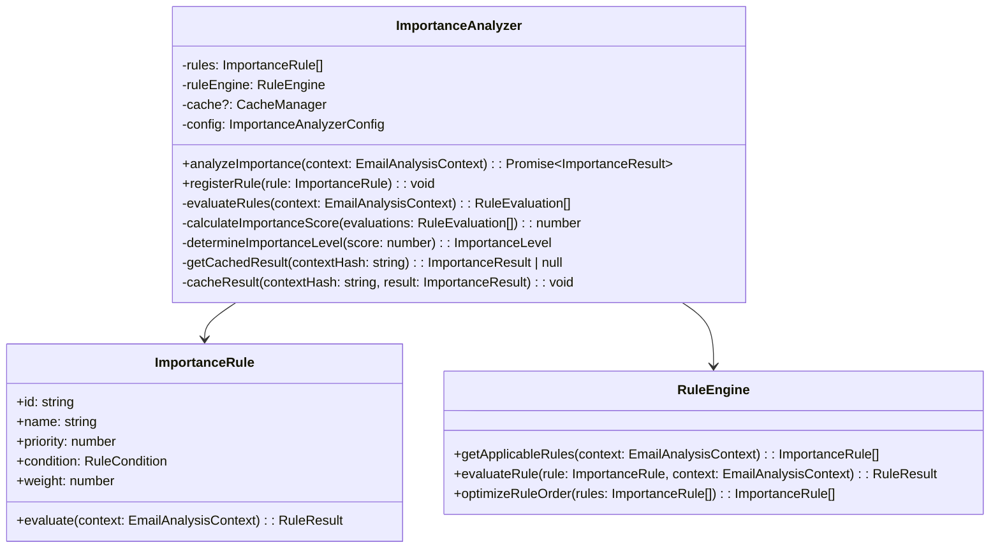
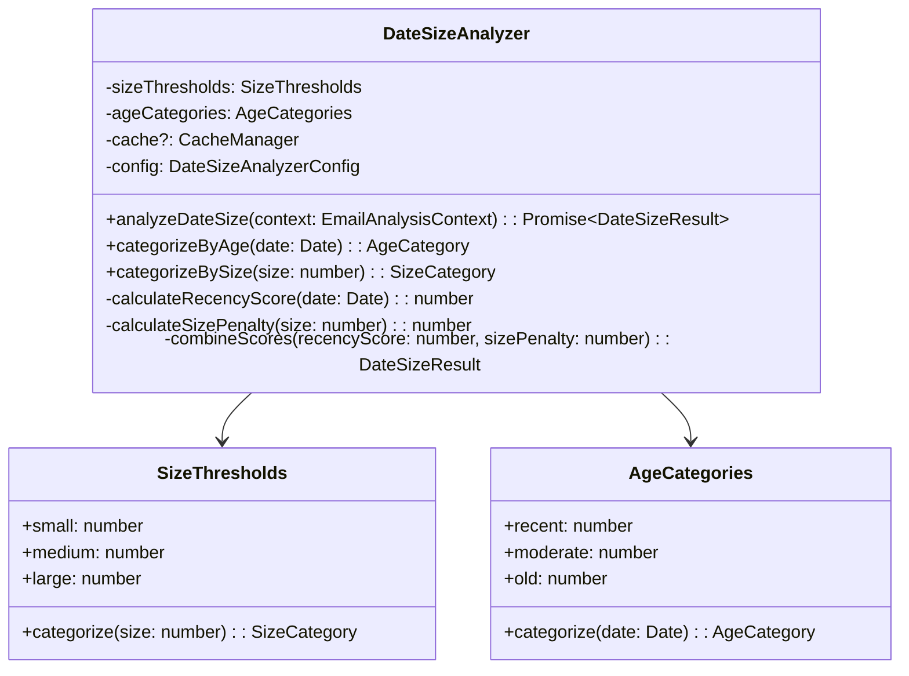
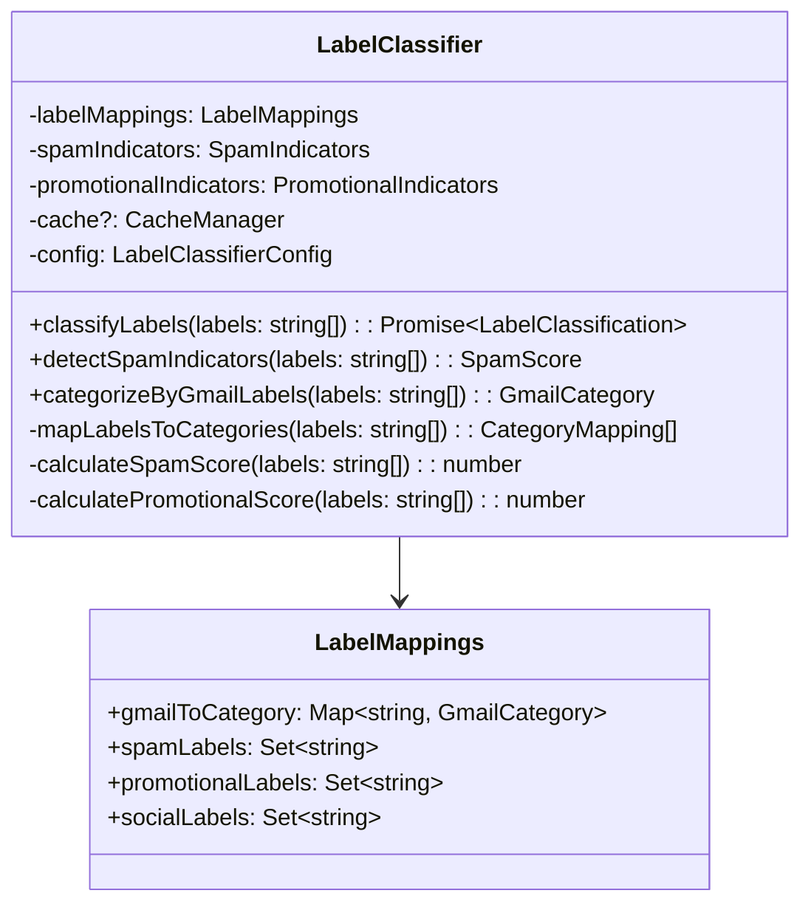
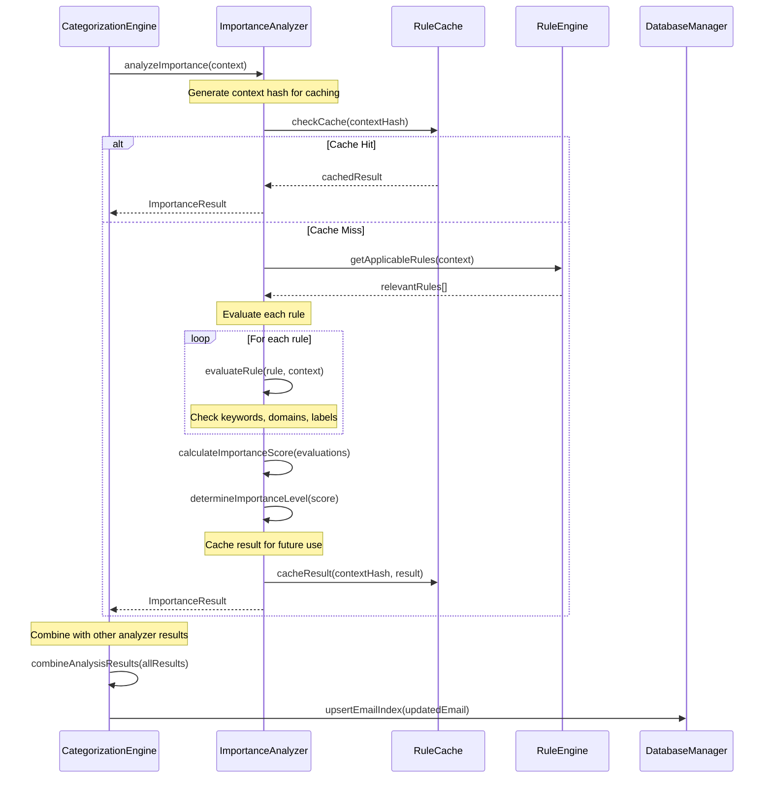
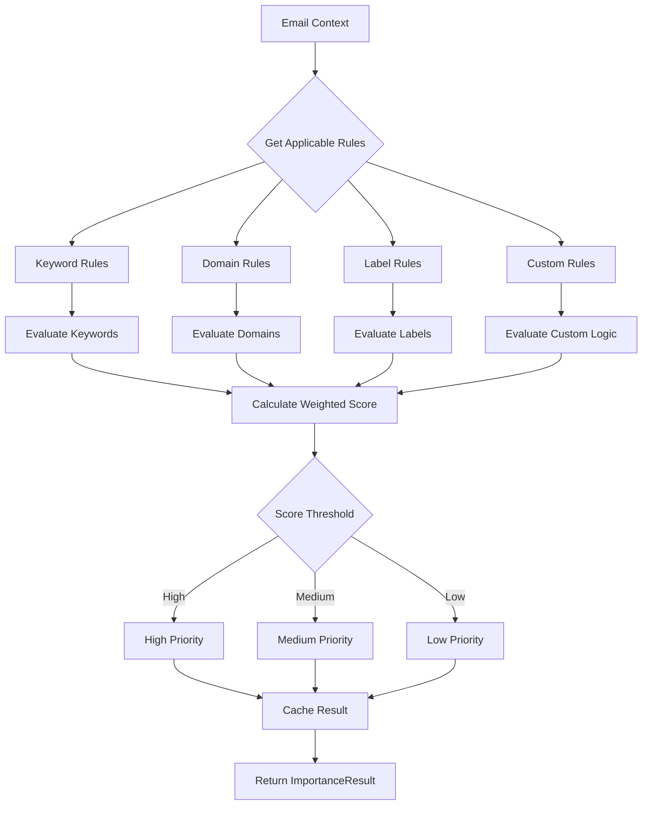
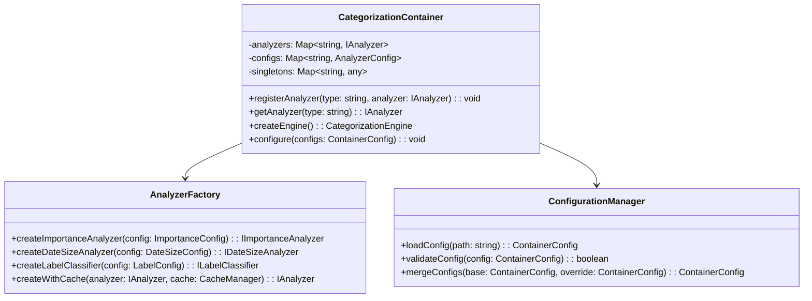
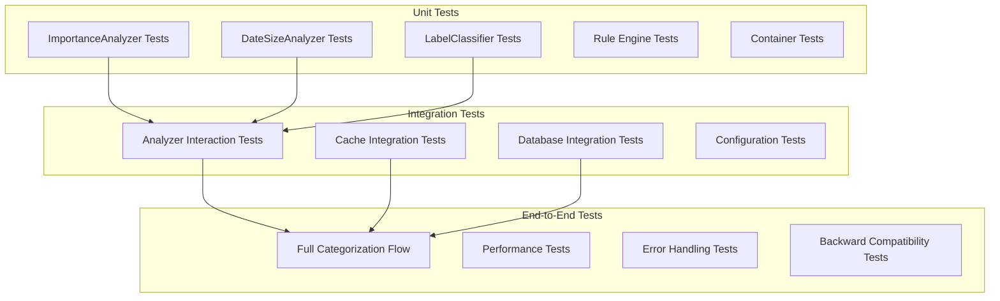

# CategorizationEngine Modular Architecture Design

## Executive Summary

This document outlines the comprehensive modular architecture design for refactoring the current monolithic [`CategorizationEngine`](../src/categorization/CategorizationEngine.ts) into a scalable, maintainable, and testable system following Single Responsibility Principle (SRP) and modern software engineering best practices.

## Current State Analysis

### SRP Violations Identified

The current [`CategorizationEngine.ts`](../src/categorization/CategorizationEngine.ts:22) violates SRP in several ways:

1. **Mixed Responsibilities**: Handles rule creation, priority analysis, email fetching coordination, statistics generation, and database operations
2. **Monolithic Rule Logic**: All priority rules (lines 27-28, 56-57) are embedded within the engine rather than being delegated to specialized analyzers
3. **Tight Coupling**: Direct database and cache dependencies make testing and modularity difficult
4. **Single Analysis Path**: No separation between importance, size/date, and label classification concerns

### Current Architecture Issues



## Proposed Modular Architecture

### Core Design Principles

1. **Single Responsibility Principle**: Each analyzer handles one specific aspect of categorization
2. **Dependency Injection**: Loose coupling through interface-based design
3. **Hybrid State Management**: Stateless core logic with optional caching layer
4. **Testability**: Each component can be tested independently
5. **Backward Compatibility**: Maintain existing [`EmailIndex`](../src/types/index.ts:42) and API contracts

### High-Level Architecture Overview



## Interface Definitions

### Core Analyzer Interfaces

```typescript
interface IAnalyzer {
  analyze(context: AnalysisContext): Promise<AnalysisResult>;
  configure(config: AnalyzerConfig): void;
}

interface IImportanceAnalyzer extends IAnalyzer {
  analyzeImportance(context: EmailAnalysisContext): Promise<ImportanceResult>;
  registerRule(rule: ImportanceRule): void;
  getApplicableRules(context: EmailAnalysisContext): ImportanceRule[];
}

interface IDateSizeAnalyzer extends IAnalyzer {
  analyzeDateSize(context: EmailAnalysisContext): Promise<DateSizeResult>;
  categorizeByAge(date: Date): AgeCategory;
  categorizeBySize(size: number): SizeCategory;
}

interface ILabelClassifier extends IAnalyzer {
  classifyLabels(labels: string[]): Promise<LabelClassification>;
  detectSpamIndicators(labels: string[]): SpamScore;
  categorizeByGmailLabels(labels: string[]): GmailCategory;
}
```

### Analysis Context and Results

```typescript
interface EmailAnalysisContext {
  email: EmailIndex;
  subject: string;
  sender: string;
  snippet: string;
  labels: string[];
  date: Date;
  size: number;
  hasAttachments: boolean;
}

interface AnalysisResult {
  importance: ImportanceResult;
  dateSize: DateSizeResult;
  labelClassification: LabelClassification;
  finalCategory: PriorityCategory;
  confidence: number;
  reasoning: string[];
}

interface ImportanceResult {
  score: number;
  level: 'high' | 'medium' | 'low';
  matchedRules: string[];
  confidence: number;
}

interface DateSizeResult {
  ageCategory: AgeCategory;
  sizeCategory: SizeCategory;
  recencyScore: number;
  sizePenalty: number;
}

interface LabelClassification {
  category: GmailCategory;
  spamScore: number;
  promotionalScore: number;
  socialScore: number;
}
```

## Detailed Component Design

### 1. CategorizationEngine (Orchestrator)



### 2. ImportanceAnalyzer Implementation



### 3. DateSizeAnalyzer Implementation



### 4. LabelClassifier Implementation



## ImportanceAnalyzer Detailed Flow

### Interaction Sequence



### Rule Evaluation Process



## Dependency Injection Architecture

### Container Design



### Configuration Structure

```typescript
interface ContainerConfig {
  analyzers: {
    importance: ImportanceAnalyzerConfig;
    dateSize: DateSizeAnalyzerConfig;
    labelClassifier: LabelClassifierConfig;
  };
  caching: {
    enabled: boolean;
    ttl: number;
    maxSize: number;
  };
  performance: {
    batchSize: number;
    parallelProcessing: boolean;
    timeoutMs: number;
  };
}

interface ImportanceAnalyzerConfig {
  rules: ImportanceRuleConfig[];
  scoring: {
    highThreshold: number;
    lowThreshold: number;
    defaultWeight: number;
  };
  caching: {
    enabled: boolean;
    keyStrategy: 'full' | 'partial';
  };
}
```

## Testing Strategy

### Testing Architecture



### Test Scenarios

#### Unit Test Coverage
- **ImportanceAnalyzer**: Rule evaluation, score calculation, caching behavior
- **DateSizeAnalyzer**: Age categorization, size categorization, score combination
- **LabelClassifier**: Label mapping, spam detection, Gmail category classification
- **RuleEngine**: Rule selection, evaluation optimization, error handling

#### Integration Test Coverage
- **Analyzer Coordination**: Proper data flow between analyzers
- **Cache Consistency**: Cache invalidation and refresh strategies
- **Database Operations**: Email index updates and statistics generation
- **Configuration Loading**: Dynamic configuration changes

#### Performance Test Coverage
- **Batch Processing**: Large email set categorization performance
- **Memory Usage**: Memory consumption under load
- **Cache Efficiency**: Cache hit rates and performance impact
- **Concurrent Processing**: Thread safety and parallel execution

## Implementation Roadmap

### Phase 1: Foundation (Week 1-2)
1. **Interface Definitions**
   - Create all analyzer interfaces
   - Define analysis context and result types
   - Establish configuration contracts

2. **Core Infrastructure**
   - Implement dependency injection container
   - Create analyzer factory
   - Set up configuration management

### Phase 2: Analyzer Implementation (Week 3-5)
1. **ImportanceAnalyzer**
   - Implement rule-based evaluation system
   - Create rule engine with optimization
   - Add caching layer integration

2. **DateSizeAnalyzer**
   - Implement age and size categorization
   - Create scoring algorithms
   - Add performance optimizations

3. **LabelClassifier**
   - Implement Gmail label mapping
   - Create spam and promotional detection
   - Add machine learning preparation hooks

### Phase 3: Engine Refactoring (Week 6-7)
1. **CategorizationEngine Transformation**
   - Refactor to orchestrator pattern
   - Implement analyzer coordination
   - Maintain backward compatibility

2. **Integration Testing**
   - End-to-end flow validation
   - Performance benchmarking
   - Error handling verification

### Phase 4: Migration & Optimization (Week 8)
1. **Migration Tools**
   - Configuration migration utilities
   - Data migration scripts
   - Rollback procedures

2. **Performance Tuning**
   - Cache optimization
   - Batch processing improvements
   - Memory usage optimization

## File Structure

```
src/categorization/
├── CategorizationEngine.ts (refactored)
├── analyzers/
│   ├── interfaces/
│   │   ├── IAnalyzer.ts
│   │   ├── IImportanceAnalyzer.ts
│   │   ├── IDateSizeAnalyzer.ts
│   │   └── ILabelClassifier.ts
│   ├── ImportanceAnalyzer.ts
│   ├── DateSizeAnalyzer.ts
│   └── LabelClassifier.ts
├── rules/
│   ├── ImportanceRule.ts
│   ├── RuleEngine.ts
│   ├── conditions/
│   │   ├── KeywordCondition.ts
│   │   ├── DomainCondition.ts
│   │   └── LabelCondition.ts
│   └── factories/
│       └── RuleFactory.ts
├── container/
│   ├── CategorizationContainer.ts
│   ├── AnalyzerFactory.ts
│   └── ConfigurationManager.ts
├── types/
│   ├── AnalysisContext.ts
│   ├── AnalysisResults.ts
│   ├── AnalyzerConfigs.ts
│   └── RuleTypes.ts
└── utils/
    ├── CacheKeyGenerator.ts
    ├── ScoreCalculator.ts
    └── PerformanceMonitor.ts
```

## Backward Compatibility

### Maintained Interfaces
- [`EmailIndex`](../src/types/index.ts:42) type structure
- [`CategorizeOptions`](../src/types/index.ts:169) interface
- [`PriorityCategory`](../src/types/index.ts:35) enum values
- [`DatabaseManager`](../src/database/DatabaseManager.ts:13) integration points
- [`CacheManager`](../src/cache/CacheManager.ts:11) usage patterns

### Migration Strategy
1. **Gradual Migration**: Implement new system alongside existing
2. **Feature Flags**: Toggle between old and new implementations
3. **Configuration Mapping**: Automatic conversion of existing rule configurations
4. **Validation Layer**: Ensure output consistency between systems

## Performance Considerations

### Optimization Strategies
1. **Caching**: Multi-level caching for rules, results, and configurations
2. **Batch Processing**: Efficient handling of large email sets
3. **Lazy Loading**: On-demand analyzer initialization
4. **Parallel Processing**: Concurrent analysis where possible

### Monitoring & Metrics
1. **Performance Metrics**: Response times, throughput, memory usage
2. **Accuracy Metrics**: Categorization accuracy, rule effectiveness
3. **System Health**: Error rates, cache hit ratios, resource utilization

## Security Considerations

### Data Protection
1. **Input Validation**: Sanitize all email content and metadata
2. **Rule Isolation**: Prevent rule injection attacks
3. **Cache Security**: Secure caching of sensitive email data
4. **Audit Logging**: Track categorization decisions and rule changes

## Conclusion

This modular architecture design transforms the monolithic [`CategorizationEngine`](../src/categorization/CategorizationEngine.ts) into a scalable, maintainable, and testable system. The design follows SOLID principles, provides clear separation of concerns, and maintains backward compatibility while enabling future extensibility.

The implementation roadmap provides a structured approach to migration, ensuring minimal disruption to existing functionality while delivering significant improvements in code quality, testability, and maintainability.

## Next Steps

1. **Review and Approval**: Stakeholder review of architectural design
2. **Prototype Development**: Create proof-of-concept implementation
3. **Performance Validation**: Benchmark against current implementation
4. **Implementation Planning**: Detailed sprint planning and resource allocation