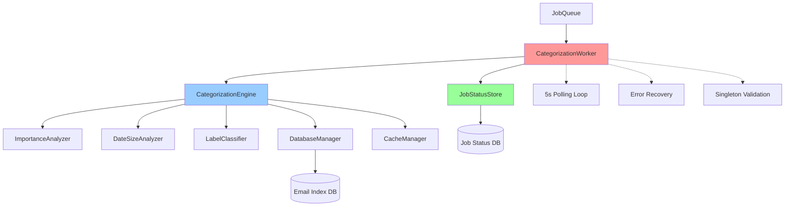
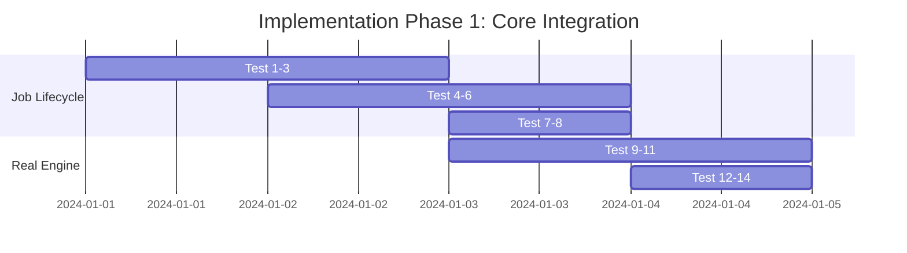
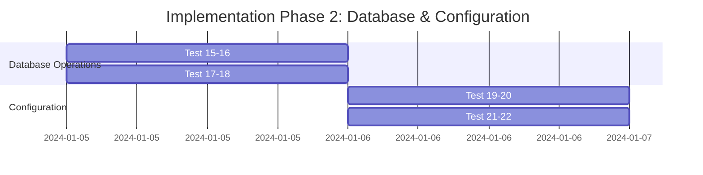
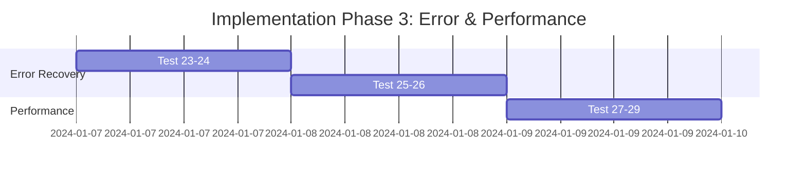
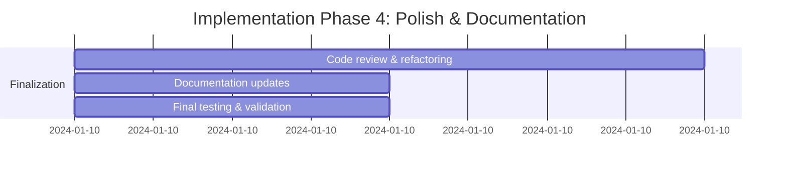

# CategorizationWorker Integration Test Design Plan

## Overview

This document outlines a comprehensive test strategy for rewriting `tests/integration/categorization/CategorizationWorker.integration.test.ts`. The current test file has only 6 basic tests with heavy mocking, missing critical integration scenarios. This design transforms it into a robust suite of 29 integration tests that thoroughly validate the real CategorizationWorker system.

## Architecture Overview

The CategorizationWorker system is complex with multiple interconnected components:



### Key System Characteristics

- **JobQueue → Worker → CategorizationEngine → 3 Analyzers** pipeline
- Real database operations with JobStatusStore and EmailIndex persistence
- Complex async job lifecycle: PENDING → IN_PROGRESS → COMPLETED/FAILED
- Singleton integrity requirements for JobStatusStore and DatabaseManager
- 5-second polling intervals with retry logic
- Real cache integration and performance tracking
- Parallel vs sequential analyzer orchestration

## Test Strategy Design

### Priority Distribution
- **Real Integration Testing**: 80% of focus
- **Error Recovery & Resilience**: 15% of focus  
- **Performance & Concurrency**: 5% of focus

### Testing Philosophy
- **Minimize Mocking**: Use real CategorizationEngine, analyzers, database, and cache
- **Comprehensive Integration**: Test complete workflows from job creation to result persistence
- **Real Data Flow**: Verify actual analyzer execution and result storage
- **Error Resilience**: Test recovery from various failure scenarios

## Test Structure Organization

```typescript
describe("CategorizationWorker Integration Tests", () => {
  describe("Job Lifecycle Integration", () => {
    // 8 tests covering complete job processing workflows
  });
  
  describe("Real Engine Execution", () => {
    // 6 tests with actual CategorizationEngine execution
  });
  
  describe("Database Operations", () => {
    // 4 tests for data consistency and persistence
  });
  
  describe("Configuration Variations", () => {
    // 4 tests for different system configurations
  });
  
  describe("Error Recovery", () => {
    // 4 tests for failure scenarios and resilience
  });
  
  describe("Performance & Concurrency", () => {
    // 3 tests for load and concurrent operations
  });
});
```

## Complete Test Case Inventory

### A. Job Lifecycle Integration (8 tests)

#### 1. `should process complete job lifecycle with real engine execution`
- **Description**: End-to-end test of job creation → processing → completion
- **Flow**: Create job → Worker processes → Engine executes → Results stored → Job completed
- **Key Assertions**:
  - Job status transitions: PENDING → IN_PROGRESS → COMPLETED
  - Timestamps are properly set (created_at, started_at, completed_at)
  - Analyzer results are persisted in EmailIndex records
  - Job results contain processed count and email IDs

#### 2. `should handle multiple jobs in sequence`
- **Description**: Sequential processing of multiple categorization jobs
- **Flow**: Queue 3 jobs with different parameters → Verify sequential execution
- **Key Assertions**:
  - Jobs processed in FIFO order
  - Each job completion before next job starts
  - No interference between job executions
  - Proper cleanup between jobs

#### 3. `should respect job priority and ordering`
- **Description**: Verify job queue management and processing order
- **Flow**: Add jobs to queue → Verify retrieval order
- **Key Assertions**:
  - FIFO job processing
  - Queue length tracking
  - Proper job ID handling

#### 4. `should handle job cancellation during processing`
- **Description**: Test graceful shutdown during active job processing
- **Flow**: Start job → Call worker.stop() during processing → Verify state
- **Key Assertions**:
  - Worker stops processing new jobs
  - Current job state is preserved
  - No data corruption occurs

#### 5. `should resume processing after worker restart`
- **Description**: Test job recovery after worker interruption
- **Flow**: Stop worker during job → Restart worker → Verify completion
- **Key Assertions**:
  - Job resumes from correct state
  - No duplicate processing
  - Results integrity maintained

#### 6. `should handle duplicate job IDs gracefully`
- **Description**: Edge case testing for job ID conflicts
- **Flow**: Attempt to create duplicate job IDs
- **Key Assertions**:
  - Proper error handling
  - Data integrity maintained
  - Clear error messages

#### 7. `should process jobs with different year filters`
- **Description**: Test year-specific email filtering
- **Flow**: Create jobs with different year parameters
- **Key Assertions**:
  - Only emails from specified year processed
  - Correct email counts in results
  - Other years remain unaffected

#### 8. `should handle forceRefresh parameter correctly`
- **Description**: Test incremental vs full refresh behavior
- **Flow**: Process emails → Change categories → Test forceRefresh
- **Key Assertions**:
  - forceRefresh=false processes only uncategorized emails
  - forceRefresh=true processes all emails
  - Recategorization works correctly

### B. Real Engine Execution (6 tests)

#### 9. `should execute real categorization with all analyzers`
- **Description**: Comprehensive test with no CategorizationEngine mocking
- **Flow**: Process diverse email set → Verify all analyzers execute
- **Key Assertions**:
  - ImportanceAnalyzer executes and provides results
  - DateSizeAnalyzer executes and provides results
  - LabelClassifier executes and provides results
  - Final categories match analyzer logic
  - Analysis metrics are tracked

#### 10. `should persist detailed analyzer results in database`
- **Description**: Verify complete analyzer result persistence
- **Flow**: Process emails → Query database → Verify stored results
- **Key Assertions**:
  - ImportanceAnalyzer results: score, level, matched rules, confidence
  - DateSizeAnalyzer results: age category, size category, recency score
  - LabelClassifier results: gmail category, spam score, indicators
  - Analysis metadata: timestamp, version

#### 11. `should handle analyzer timeout scenarios`
- **Description**: Test timeout handling with real analyzers
- **Flow**: Configure short timeouts → Process emails → Verify behavior
- **Key Assertions**:
  - Timeout errors are caught and handled
  - Fallback categorization applied
  - Error logging occurs
  - Job doesn't fail completely

#### 12. `should process different email types with real analysis`
- **Description**: Verify correct categorization of various email types
- **Test Data**: 
  - High priority: urgent keywords, VIP domains, important labels
  - Low priority: promotional content, spam indicators, large attachments
  - Medium priority: regular business emails
- **Key Assertions**:
  - High priority emails categorized as 'high'
  - Low priority emails categorized as 'low'
  - Medium priority emails categorized as 'medium'
  - Analyzer reasoning is logical and traceable

#### 13. `should handle parallel vs sequential analyzer execution`
- **Description**: Test both orchestration modes
- **Flow**: Test with enableParallelProcessing=true/false
- **Key Assertions**:
  - Both modes produce consistent results
  - Performance differences are tracked
  - No race conditions in parallel mode
  - Metrics reflect execution mode

#### 14. `should track and report analysis metrics accurately`
- **Description**: Verify performance metrics collection
- **Flow**: Process emails → Check analysis metrics
- **Key Assertions**:
  - totalProcessingTime > 0
  - Individual analyzer times tracked (in sequential mode)
  - Cache hit/miss ratios recorded
  - Rules evaluated count is accurate

### C. Database Operations (4 tests)

#### 15. `should maintain data consistency across job and email tables`
- **Description**: Test transactional integrity between tables
- **Flow**: Process job → Verify data consistency
- **Key Assertions**:
  - Job status matches email categorization state
  - No orphaned records
  - Referential integrity maintained
  - Rollback works on failures

#### 16. `should handle database connection issues during processing`
- **Description**: Test database resilience
- **Flow**: Simulate connection drops during processing
- **Key Assertions**:
  - Connection recovery mechanisms work
  - Job processing resumes correctly
  - Data integrity preserved
  - Appropriate error logging

#### 17. `should cleanup job data appropriately`
- **Description**: Test job lifecycle data management
- **Flow**: Complete jobs → Verify cleanup behavior
- **Key Assertions**:
  - Completed jobs remain accessible
  - Old jobs can be cleaned up
  - Email data remains intact
  - Performance impact is minimal

#### 18. `should handle concurrent database access`
- **Description**: Test database locking and conflict resolution
- **Flow**: Simulate concurrent database operations
- **Key Assertions**:
  - No deadlocks occur
  - Data consistency maintained
  - Proper error handling for conflicts
  - Performance remains acceptable

### D. Configuration Variations (4 tests)

#### 19. `should work with different analyzer configurations`
- **Description**: Test custom analyzer rules and settings
- **Test Configurations**:
  - Custom importance rules and thresholds
  - Modified date/size categories
  - Different label mappings
- **Key Assertions**:
  - Configuration changes affect categorization results
  - Results are consistent with new rules
  - Performance impact is acceptable

#### 20. `should handle configuration updates during operation`
- **Description**: Test runtime configuration changes
- **Flow**: Start processing → Update config → Verify new behavior
- **Key Assertions**:
  - New jobs use updated configuration
  - In-flight jobs complete with original config
  - No system instability

#### 21. `should validate configuration integrity`
- **Description**: Test configuration validation
- **Test Cases**: Invalid thresholds, malformed rules, missing required fields
- **Key Assertions**:
  - Invalid configurations rejected
  - Clear validation error messages
  - System remains stable
  - Fallback to default configuration when appropriate

#### 22. `should work with different orchestration settings`
- **Description**: Test various orchestration parameters
- **Test Parameters**:
  - Batch sizes (1, 25, 100)
  - Timeouts (1s, 30s, 60s)
  - Retry attempts (1, 3, 5)
- **Key Assertions**:
  - All configurations produce correct results
  - Performance scales appropriately
  - Error handling works with all settings

### E. Error Recovery (4 tests)

#### 23. `should recover from analyzer failures`
- **Description**: Test individual analyzer failure scenarios
- **Flow**: Inject failures in each analyzer → Verify recovery
- **Key Assertions**:
  - Partial analyzer failures don't crash entire job
  - Fallback categorization applied
  - Error details captured in job results
  - System continues processing other emails

#### 24. `should handle malformed email data gracefully`
- **Description**: Test resilience with bad data
- **Test Data**: Missing subject/sender/snippet, invalid data types, null values
- **Key Assertions**:
  - Bad emails handled individually
  - Error logging occurs
  - Processing continues for valid emails
  - Appropriate fallback categories assigned

#### 25. `should implement proper retry logic for transient failures`
- **Description**: Test retry mechanisms
- **Failure Types**: Network timeouts, temporary database locks, analyzer timeouts
- **Key Assertions**:
  - Transient failures are retried
  - Exponential backoff implemented
  - Permanent failures abort gracefully
  - Retry counts are respected

#### 26. `should maintain singleton integrity under stress`
- **Description**: Test singleton validation during concurrent operations
- **Flow**: Multiple initialization attempts, concurrent access patterns
- **Key Assertions**:
  - Singleton violations detected and prevented
  - Clear error messages for violations
  - System remains stable
  - Data consistency maintained

### F. Performance & Concurrency (3 tests)

#### 27. `should handle large email batches efficiently`
- **Description**: Performance testing with substantial data volumes
- **Test Data**: 1000+ emails with varied characteristics
- **Key Assertions**:
  - Processing time < 30 seconds for 1000 emails
  - Memory usage remains stable
  - All emails processed correctly
  - Performance metrics within acceptable bounds

#### 28. `should maintain performance with cache utilization`
- **Description**: Test cache effectiveness
- **Flow**: Process emails → Clear some cache → Reprocess → Compare performance
- **Key Assertions**:
  - Cache hit ratios > 80% on reprocessing
  - Cache misses handled gracefully
  - Performance improvement with cache
  - Cache consistency maintained

#### 29. `should handle concurrent job requests`
- **Description**: Test job queue under concurrent load
- **Flow**: Submit multiple jobs simultaneously
- **Key Assertions**:
  - All jobs processed correctly
  - No race conditions
  - Proper serialization maintained
  - Performance remains acceptable

## Testing Patterns and Infrastructure

### Real vs Mocked Components Strategy

```typescript
// REAL COMPONENTS (No Mocking):
✅ CategorizationEngine - Full execution with real analyzers
✅ ImportanceAnalyzer - Real rule evaluation and scoring
✅ DateSizeAnalyzer - Real date/size calculations
✅ LabelClassifier - Real label processing
✅ DatabaseManager - Real SQLite database operations
✅ JobStatusStore - Real job persistence
✅ CacheManager - Real caching behavior

// MOCKED COMPONENTS (Only When Necessary):
🔧 External network calls (if any)
🔧 System time (using jest.useFakeTimers for timing tests)
🔧 File system operations (if any)
```

### Async/Timing Handling Patterns

```typescript
// Pattern for job completion waiting:
async function waitForJobCompletion(jobId: string, timeout = 30000): Promise<Job> {
  const startTime = Date.now();
  while (Date.now() - startTime < timeout) {
    const job = await jobStatusStore.getJobStatus(jobId);
    if (job && [JobStatus.COMPLETED, JobStatus.FAILED].includes(job.status)) {
      return job;
    }
    await new Promise(resolve => setTimeout(resolve, 100));
  }
  throw new Error(`Job ${jobId} did not complete within ${timeout}ms`);
}

// Pattern for worker lifecycle management:
beforeEach(async () => {
  worker = new CategorizationWorker(jobQueue, categorizationEngine);
});

afterEach(async () => {
  worker.stop();
  await waitForWorkerShutdown();
});
```

### Database and Cleanup Strategy

```typescript
// Enhanced setup/teardown:
beforeEach(async () => {
  // Create isolated test database
  dbManager = await createTestDatabaseManager();
  jobStatusStore = JobStatusStore.getInstance();
  await jobStatusStore.initialize();
  
  // Seed realistic test data
  await seedRealisticTestData(dbManager);
  
  // Initialize components with real dependencies
  jobQueue = new JobQueue();
  cacheManager = new CacheManager();
  categorizationEngine = new CategorizationEngine(dbManager, cacheManager);
  worker = new CategorizationWorker(jobQueue, categorizationEngine);
});

afterEach(async () => {
  // Graceful shutdown
  worker.stop();
  await cleanupTestDatabase(dbManager);
  await clearJobQueue();
  jest.clearAllMocks();
});
```

## Test Data and Fixtures

### Email Data Sets

#### High Priority Email Set
```typescript
const highPriorityEmails = [
  {
    id: 'urgent-1',
    subject: 'URGENT: System Down - Immediate Action Required',
    sender: 'admin@company.com',
    labels: ['INBOX', 'IMPORTANT'],
    keywords: ['urgent', 'critical', 'emergency']
  },
  {
    id: 'vip-domain-1', 
    subject: 'Meeting Request',
    sender: 'ceo@company.com', // VIP domain
    labels: ['INBOX']
  }
  // ... more high priority variations
];
```

#### Low Priority Email Set
```typescript
const lowPriorityEmails = [
  {
    id: 'promotional-1',
    subject: 'Special Sale - 50% Off Everything!',
    sender: 'noreply@store.com',
    labels: ['INBOX', 'PROMOTIONS'],
    keywords: ['sale', 'discount', 'offer']
  },
  {
    id: 'large-attachment-1',
    subject: 'System Report',
    size: 15000000, // 15MB
    hasAttachments: true
  }
  // ... more low priority variations
];
```

#### Edge Case Email Set
```typescript
const edgeCaseEmails = [
  {
    id: 'missing-subject',
    subject: undefined, // Missing required field
    sender: 'test@example.com'
  },
  {
    id: 'empty-labels',
    subject: 'Test Email',
    labels: [] // Empty labels array
  }
  // ... more edge cases
];
```

### Job Parameter Variations

```typescript
const jobParameterVariations = [
  { description: 'Current year incremental', params: { year: 2024, forceRefresh: false } },
  { description: 'Previous year full refresh', params: { year: 2023, forceRefresh: true } },
  { description: 'All years incremental', params: { forceRefresh: false } },
  { description: 'All years full refresh', params: { forceRefresh: true } },
  { description: 'Invalid parameters', params: { invalidParam: true } }
];
```

### Configuration Variations

```typescript
const configurationVariations = [
  {
    name: 'Default Configuration',
    config: DEFAULT_CATEGORIZATION_CONFIG
  },
  {
    name: 'High Sensitivity Configuration',
    config: {
      analyzers: {
        importance: {
          scoring: { highThreshold: 5, lowThreshold: -3 }
        }
      }
    }
  },
  {
    name: 'Performance Optimized Configuration',
    config: {
      orchestration: {
        enableParallelProcessing: true,
        batchSize: 100,
        timeoutMs: 15000
      }
    }
  }
];
```

## Test Utilities and Helpers

### New Helper Functions Required

```typescript
// Job Processing Helpers
async function waitForJobCompletion(jobId: string, options?: { timeout: number }): Promise<Job>;
async function waitForJobStatus(jobId: string, status: JobStatus, timeout: number): Promise<Job>;
async function createJobAndWaitForCompletion(params: any): Promise<{ job: Job, result: any }>;
async function submitMultipleJobs(jobParams: any[]): Promise<string[]>;

// Analyzer Result Verification
async function verifyAnalyzerResultsPersistence(emailId: string, expectedResults: AnalyzerResults): Promise<void>;
async function verifyJobResultsIntegrity(jobId: string): Promise<void>;
async function assertAnalyzerResultsComplete(emailIds: string[]): Promise<void>;

// Performance and Metrics
function measureProcessingTime<T>(operation: () => Promise<T>): Promise<{ result: T, timeMs: number }>;
async function generateLargeEmailDataset(count: number, characteristics?: EmailCharacteristics): Promise<EmailIndex[]>;
async function measureMemoryUsage<T>(operation: () => Promise<T>): Promise<{ result: T, memoryDelta: number }>;

// Configuration Management
function createTestConfiguration(overrides: Partial<CategorizationSystemConfig>): CategorizationSystemConfig;
async function updateWorkerConfiguration(worker: CategorizationWorker, config: CategorizationSystemConfig): Promise<void>;
function validateConfigurationIntegrity(config: CategorizationSystemConfig): { valid: boolean, errors: string[] };

// Error Injection and Simulation
function injectAnalyzerError(analyzerType: 'importance' | 'dateSize' | 'label', errorType: string): void;
function simulateNetworkTimeout(durationMs: number): void;
function simulateDatabaseConnectionDrop(): void;
async function simulateSystemLoad(): Promise<void>;

// Database and Data Management
async function seedRealisticTestData(dbManager: DatabaseManager, emailCount?: number): Promise<EmailIndex[]>;
async function verifyDatabaseConsistency(dbManager: DatabaseManager): Promise<boolean>;
async function cleanupTestArtifacts(): Promise<void>;

// Worker Lifecycle Management
async function waitForWorkerShutdown(worker: CategorizationWorker, timeout?: number): Promise<void>;
async function restartWorker(worker: CategorizationWorker): Promise<void>;
function getWorkerState(worker: CategorizationWorker): WorkerState;
```

### Enhanced Assertion Helpers

```typescript
// Complex Validation Helpers
async function assertCompleteJobExecution(jobId: string): Promise<void> {
  const job = await jobStatusStore.getJobStatus(jobId);
  expect(job).not.toBeNull();
  expect(job!.status).toBe(JobStatus.COMPLETED);
  expect(job!.results).toBeDefined();
  expect(job!.completed_at).toBeDefined();
  expect(job!.results.processed).toBeGreaterThan(0);
}

async function assertAnalyzerResultsIntegrity(emailIds: string[]): Promise<void> {
  for (const emailId of emailIds) {
    const email = await dbManager.getEmailIndex(emailId);
    expect(email).toBeDefined();
    expect(email!.category).not.toBeNull();
    expect(email!.importanceLevel).toBeDefined();
    expect(email!.ageCategory).toBeDefined();
    expect(email!.sizeCategory).toBeDefined();
    expect(email!.analysisTimestamp).toBeDefined();
  }
}

async function assertPerformanceMetrics(metrics: AnalysisMetrics, expectations: {
  totalTime?: { max: number };
  cacheHitRatio?: { min: number };
  rulesEvaluated?: { min: number };
}): Promise<void> {
  if (expectations.totalTime) {
    expect(metrics.totalProcessingTime).toBeLessThan(expectations.totalTime.max);
  }
  if (expectations.cacheHitRatio) {
    const hitRatio = metrics.cacheHits / (metrics.cacheHits + metrics.cacheMisses);
    expect(hitRatio).toBeGreaterThan(expectations.cacheHitRatio.min);
  }
  if (expectations.rulesEvaluated) {
    expect(metrics.rulesEvaluated).toBeGreaterThanOrEqual(expectations.rulesEvaluated.min);
  }
}
```

## Implementation Phases

### Phase 1: Core Integration (Days 1-4)


**Deliverables:**
- 8 Job Lifecycle Integration tests
- 6 Real Engine Execution tests
- Enhanced test utilities for job management
- Analyzer result verification helpers

### Phase 2: Database & Configuration (Days 5-6)


**Deliverables:**
- 4 Database Operations tests
- 4 Configuration Variations tests
- Database consistency validation helpers
- Configuration management utilities

### Phase 3: Error & Performance (Days 7-9)


**Deliverables:**
- 4 Error Recovery tests
- 3 Performance & Concurrency tests
- Error injection utilities
- Performance measurement helpers

### Phase 4: Polish & Documentation (Day 10)


**Deliverables:**
- Complete test suite (29 tests)
- Updated documentation
- Performance benchmarks
- Implementation guide

## Success Criteria

### Coverage Metrics
- **Test Count**: 29 comprehensive integration tests (vs 6 basic tests currently)
- **Real Component Usage**: 95% real components, <5% mocking
- **Code Coverage**: >90% coverage of CategorizationWorker and related integration paths
- **Scenario Coverage**: All major user workflows and error conditions tested

### Quality Metrics
- **Test Reliability**: All tests pass consistently (>99% success rate)
- **Test Performance**: Full suite completes in <2 minutes
- **Test Maintainability**: Clear test structure and comprehensive helpers
- **Documentation**: Complete test documentation and implementation guide

### Functional Validation
- **Real Integration**: Actual CategorizationEngine execution with database persistence
- **Data Integrity**: Analyzer results correctly stored and retrievable
- **Error Resilience**: System gracefully handles failures and recovers
- **Performance**: Acceptable performance under realistic loads

## Expected Benefits

### Development Confidence
- High confidence in CategorizationWorker reliability
- Early detection of integration issues
- Regression protection during refactoring
- Clear documentation of expected system behavior

### System Quality
- Validated real-world performance characteristics
- Proven error recovery mechanisms
- Comprehensive edge case handling
- Production-ready reliability

### Maintenance Efficiency
- Clear test structure for future enhancements
- Comprehensive test utilities for ongoing development
- Performance baselines for optimization efforts
- Well-documented system behavior for debugging

---

This comprehensive test design transforms the CategorizationWorker integration testing from basic mocked scenarios to thorough validation of the real system, ensuring robust production readiness and maintainable test infrastructure.