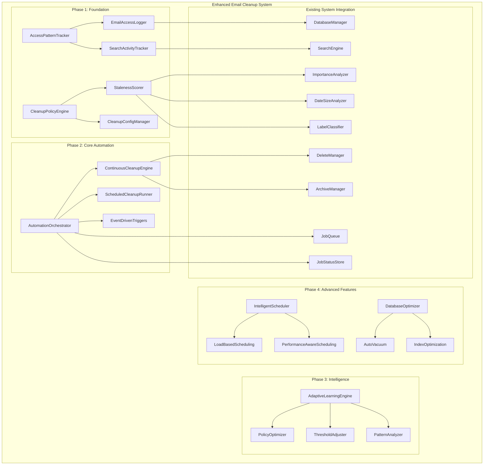

# Gmail MCP Server - Email Cleanup System Architecture

## Executive Summary

This document outlines the comprehensive architecture for an automated email cleanup system designed to integrate with the existing Gmail MCP Server. The system provides intelligent, multi-factor email cleanup with continuous background processing, adaptive learning, and event-driven automation.

## Current System Analysis

### Existing Architecture Strengths
- **Sophisticated Categorization Engine**: Multi-analyzer system with [`ImportanceAnalyzer`](../src/categorization/analyzers/ImportanceAnalyzer.ts), [`DateSizeAnalyzer`](../src/categorization/analyzers/DateSizeAnalyzer.ts), and [`LabelClassifier`](../src/categorization/analyzers/LabelClassifier.ts)
- **Robust Database Schema**: SQLite with comprehensive email metadata and analyzer results
- **Job Queue System**: Async processing with [`JobQueue`](../src/database/JobQueue.ts) and [`JobStatusStore`](../src/database/JobStatusStore.ts)
- **Existing Managers**: [`DeleteManager`](../src/delete/DeleteManager.ts) and [`ArchiveManager`](../src/archive/ArchiveManager.ts) for email operations
- **Modular Design**: Factory pattern for analyzers, configurable scoring

### Architecture Gaps for Cleanup System
- No access pattern tracking for frequently referenced emails
- No automated cleanup policy engine
- No continuous background cleanup processing
- No database optimization post-cleanup
- No adaptive learning and threshold adjustment

---

## Overall System Architecture



---

# Implementation Plan

## Phase 1: Foundation Infrastructure (Week 1-2)

### 1.1 Access Pattern Tracking System

**Objective**: Track email access patterns and search activity to identify frequently referenced emails for preservation.

#### Database Schema Extensions

```sql
-- Email access tracking
CREATE TABLE email_access_log (
  id INTEGER PRIMARY KEY AUTOINCREMENT,
  email_id TEXT NOT NULL,
  access_type TEXT NOT NULL CHECK(access_type IN ('search_result', 'direct_view', 'thread_view')),
  timestamp INTEGER NOT NULL,
  search_query TEXT,
  user_context TEXT,
  FOREIGN KEY (email_id) REFERENCES email_index(id)
);

-- Search activity tracking
CREATE TABLE search_activity (
  search_id TEXT PRIMARY KEY,
  query TEXT NOT NULL,
  email_results TEXT, -- JSON array of email IDs
  result_interactions TEXT, -- JSON array of clicked email IDs
  timestamp INTEGER NOT NULL,
  result_count INTEGER
);

-- Access pattern summary (optimized for queries)
CREATE TABLE email_access_summary (
  email_id TEXT PRIMARY KEY,
  total_accesses INTEGER DEFAULT 0,
  last_accessed INTEGER,
  search_appearances INTEGER DEFAULT 0,
  search_interactions INTEGER DEFAULT 0,
  access_score REAL DEFAULT 0,
  updated_at INTEGER DEFAULT (strftime('%s', 'now')),
  FOREIGN KEY (email_id) REFERENCES email_index(id)
);

-- Indexes for performance
CREATE INDEX idx_access_log_email_id ON email_access_log(email_id);
CREATE INDEX idx_access_log_timestamp ON email_access_log(timestamp);
CREATE INDEX idx_search_activity_timestamp ON search_activity(timestamp);
CREATE INDEX idx_access_summary_score ON email_access_summary(access_score);
```

#### Core Components

**AccessPatternTracker Interface**
```typescript
interface EmailAccessEvent {
  email_id: string;
  access_type: 'search_result' | 'direct_view' | 'thread_view';
  timestamp: Date;
  search_query?: string;
  user_context?: string;
}

interface SearchActivityRecord {
  search_id: string;
  query: string;
  email_results: string[];
  timestamp: Date;
  result_interactions: string[];
}

interface EmailAccessSummary {
  email_id: string;
  total_accesses: number;
  last_accessed: Date;
  search_appearances: number;
  search_interactions: number;
  access_score: number;
}

class AccessPatternTracker {
  async logEmailAccess(event: EmailAccessEvent): Promise<void>;
  async logSearchActivity(record: SearchActivityRecord): Promise<void>;
  async updateAccessSummary(email_id: string): Promise<void>;
  async getAccessSummary(email_id: string): Promise<EmailAccessSummary | null>;
  async calculateAccessScore(email_id: string): Promise<number>;
}
```

### 1.2 Cleanup Policy Engine

**Objective**: Create configurable policies for determining email staleness and cleanup actions.

#### Policy Configuration Schema

```typescript
interface CleanupPolicy {
  id: string;
  name: string;
  enabled: boolean;
  priority: number;
  
  // Staleness criteria
  criteria: {
    age_days_min: number;
    importance_level_max: 'high' | 'medium' | 'low';
    size_threshold_min?: number; // bytes
    spam_score_min?: number; // 0-1
    promotional_score_min?: number; // 0-1
    access_score_max?: number; // 0-1
    no_access_days?: number;
  };
  
  // Actions to take
  action: {
    type: 'archive' | 'delete';
    method?: 'gmail' | 'export';
    export_format?: 'mbox' | 'json';
  };
  
  // Safety settings
  safety: {
    max_emails_per_run: number;
    require_confirmation: boolean;
    dry_run_first: boolean;
    preserve_important: boolean;
  };
  
  // Scheduling
  schedule?: {
    frequency: 'continuous' | 'daily' | 'weekly' | 'monthly';
    time?: string; // HH:MM format
    enabled: boolean;
  };
}

interface StalenessScore {
  email_id: string;
  total_score: number; // 0-1, higher = more stale
  factors: {
    age_score: number;           // 0-1 (higher = older)
    importance_score: number;    // 0-1 (higher = less important)
    size_penalty: number;        // 0-1 (higher = larger)
    spam_score: number;          // 0-1 (higher = more spam-like)
    access_score: number;        // 0-1 (higher = less accessed)
  };
  recommendation: 'keep' | 'archive' | 'delete';
  confidence: number; // 0-1
}
```

#### Core Components

```typescript
class CleanupPolicyEngine {
  async createPolicy(policy: CleanupPolicy): Promise<string>;
  async updatePolicy(policyId: string, updates: Partial<CleanupPolicy>): Promise<void>;
  async deletePolicy(policyId: string): Promise<void>;
  async getActivePolicies(): Promise<CleanupPolicy[]>;
  async validatePolicy(policy: CleanupPolicy): Promise<{ valid: boolean; errors: string[] }>;
}

class StalenessScorer {
  async calculateStaleness(email: EmailIndex, accessSummary: EmailAccessSummary): Promise<StalenessScore>;
  private calculateAgeScore(date: Date): number;
  private calculateImportanceScore(email: EmailIndex): number;
  private calculateSizeScore(size: number): number;
  private calculateSpamScore(email: EmailIndex): number;
  private calculateAccessScore(accessSummary: EmailAccessSummary): number;
}
```

#### Database Schema for Policies

```sql
-- Cleanup policies storage
CREATE TABLE cleanup_policies (
  id TEXT PRIMARY KEY,
  name TEXT NOT NULL,
  enabled INTEGER DEFAULT 1,
  priority INTEGER DEFAULT 50,
  criteria TEXT NOT NULL, -- JSON
  action TEXT NOT NULL,   -- JSON
  safety TEXT NOT NULL,   -- JSON
  schedule TEXT,          -- JSON, nullable
  created_at INTEGER DEFAULT (strftime('%s', 'now')),
  updated_at INTEGER DEFAULT (strftime('%s', 'now'))
);

-- Policy execution history
CREATE TABLE policy_execution_history (
  execution_id TEXT PRIMARY KEY,
  policy_id TEXT NOT NULL,
  started_at INTEGER NOT NULL,
  completed_at INTEGER,
  emails_processed INTEGER DEFAULT 0,
  emails_cleaned INTEGER DEFAULT 0,
  errors_encountered INTEGER DEFAULT 0,
  success BOOLEAN DEFAULT 0,
  FOREIGN KEY (policy_id) REFERENCES cleanup_policies(id)
);
```

---

## Phase 2: Core Automation Engine (Week 3-4)

### 2.1 Automation Orchestrator

**Objective**: Central coordinator for all automated cleanup operations with intelligent scheduling and execution.

#### Core Architecture

```typescript
interface AutomationConfig {
  continuous_cleanup: {
    enabled: boolean;
    target_emails_per_minute: number;
    max_concurrent_operations: number;
    pause_during_peak_hours: boolean;
    peak_hours: { start: string; end: string }; // HH:MM format
  };
  
  event_triggers: {
    storage_threshold: {
      enabled: boolean;
      warning_threshold_percent: number; // 80%
      critical_threshold_percent: number; // 95%
      emergency_policies: string[]; // policy IDs
    };
    performance_threshold: {
      enabled: boolean;
      query_time_threshold_ms: number;
      cache_hit_rate_threshold: number;
    };
    email_volume_threshold: {
      enabled: boolean;
      daily_email_threshold: number;
      immediate_cleanup_policies: string[];
    };
  };
}

class AutomationOrchestrator {
  private continuousCleanupEngine: ContinuousCleanupEngine;
  private scheduledCleanupRunner: ScheduledCleanupRunner;
  private eventDrivenTriggers: EventDrivenTriggers;
  
  async initialize(config: AutomationConfig): Promise<void>;
  async startAutomation(): Promise<void>;
  async stopAutomation(): Promise<void>;
  async pauseAutomation(durationMs: number): Promise<void>;
  async getAutomationStatus(): Promise<AutomationStatus>;
}
```

### 2.2 Continuous Cleanup Engine

**Objective**: Background service that continuously processes emails for cleanup in small batches.

```typescript
class ContinuousCleanupEngine {
  private isRunning: boolean = false;
  private rateLimiter: RateLimiter;
  private performanceMonitor: PerformanceMonitor;
  
  async startContinuousCleanup(): Promise<void> {
    this.isRunning = true;
    
    while (this.isRunning) {
      try {
        // Check system health and adjust operation rate
        const systemHealth = await this.performanceMonitor.getSystemHealth();
        this.rateLimiter.adjustRate(systemHealth);
        
        // Skip if during peak hours
        if (this.isDuringPeakHours()) {
          await this.sleep(60000); // Wait 1 minute
          continue;
        }
        
        // Get next batch of emails to process
        const emailBatch = await this.getNextCleanupBatch();
        
        if (emailBatch.length > 0) {
          await this.processCleanupBatch(emailBatch);
        }
        
        // Adaptive sleep based on system load
        const sleepDuration = this.calculateSleepDuration(systemHealth);
        await this.sleep(sleepDuration);
        
      } catch (error) {
        logger.error('Continuous cleanup error:', error);
        await this.sleep(5000); // Back off on errors
      }
    }
  }
  
  private async getNextCleanupBatch(): Promise<EmailIndex[]> {
    // Get emails ordered by staleness score
    const query = {
      limit: this.config.batch_size,
      orderBy: 'staleness_score',
      orderDirection: 'DESC',
      exclude_recently_accessed: true
    };
    
    return this.databaseManager.searchEmails(query);
  }
  
  private async processCleanupBatch(emails: EmailIndex[]): Promise<void> {
    const activePolicies = await this.policyEngine.getActivePolicies();
    
    for (const email of emails) {
      const accessSummary = await this.accessTracker.getAccessSummary(email.id);
      const stalenessScore = await this.stalenessScorer.calculateStaleness(email, accessSummary);
      
      // Find applicable policy
      const applicablePolicy = this.findApplicablePolicy(stalenessScore, activePolicies);
      
      if (applicablePolicy && this.shouldExecuteCleanup(stalenessScore, applicablePolicy)) {
        await this.executeCleanup(email, applicablePolicy);
      }
    }
  }
}
```

### 2.3 Event-Driven Triggers

**Objective**: Respond automatically to system events like storage pressure or performance degradation.

```typescript
class EventDrivenTriggers {
  private storageMonitor: StorageMonitor;
  private performanceMonitor: PerformanceMonitor;
  private eventHandlers: Map<string, EventHandler>;
  
  async setupTriggers(config: AutomationConfig['event_triggers']): Promise<void> {
    // Storage threshold monitoring
    if (config.storage_threshold.enabled) {
      this.storageMonitor.onThresholdExceeded(async (usage) => {
        await this.handleStorageThreshold(usage, config.storage_threshold);
      });
    }
    
    // Performance threshold monitoring
    if (config.performance_threshold.enabled) {
      this.performanceMonitor.onPerformanceDegradation(async (metrics) => {
        await this.handlePerformanceThreshold(metrics, config.performance_threshold);
      });
    }
    
    // Email volume monitoring
    if (config.email_volume_threshold.enabled) {
      this.emailVolumeMonitor.onVolumeThreshold(async (count) => {
        await this.handleEmailVolumeThreshold(count, config.email_volume_threshold);
      });
    }
  }
  
  private async handleStorageThreshold(
    usage: number, 
    config: AutomationConfig['event_triggers']['storage_threshold']
  ): Promise<void> {
    if (usage >= config.critical_threshold_percent) {
      logger.warn(`Critical storage usage: ${usage}% - executing emergency cleanup`);
      await this.executeEmergencyCleanup(config.emergency_policies);
    } else if (usage >= config.warning_threshold_percent) {
      logger.info(`Storage warning: ${usage}% - accelerating cleanup`);
      await this.accelerateCleanup(2.0); // Double the cleanup rate
    }
  }
}
```

### 2.4 Enhanced Job Management

**Objective**: Extend existing job system with cleanup-specific job types and management.

```typescript
interface CleanupJob extends Job {
  job_type: 'continuous_cleanup' | 'scheduled_cleanup' | 'event_cleanup' | 'emergency_cleanup';
  
  cleanup_metadata: {
    policy_id?: string;
    triggered_by: 'schedule' | 'storage_threshold' | 'performance' | 'user_request' | 'continuous';
    priority: 'low' | 'normal' | 'high' | 'emergency';
    batch_size: number;
    target_emails: number;
  };
  
  progress_details: {
    emails_analyzed: number;
    emails_cleaned: number;
    storage_freed: number;
    errors_encountered: number;
    current_batch: number;
    total_batches: number;
  };
}

class CleanupJobManager extends JobStatusStore {
  async createCleanupJob(
    type: CleanupJob['job_type'],
    metadata: CleanupJob['cleanup_metadata']
  ): Promise<string> {
    const jobId = await this.createJob(type, {
      cleanup_metadata: metadata,
      progress_details: {
        emails_analyzed: 0,
        emails_cleaned: 0,
        storage_freed: 0,
        errors_encountered: 0,
        current_batch: 0,
        total_batches: 0
      }
    });
    
    return jobId;
  }
  
  async updateCleanupProgress(
    jobId: string, 
    progress: Partial<CleanupJob['progress_details']>
  ): Promise<void> {
    await this.updateJobStatus(jobId, JobStatus.IN_PROGRESS, {
      progress_details: progress
    });
  }
}
```

#### Database Schema Extensions

```sql
-- Enhanced job tracking for cleanup operations
ALTER TABLE job_statuses ADD COLUMN cleanup_metadata TEXT; -- JSON
ALTER TABLE job_statuses ADD COLUMN progress_details TEXT; -- JSON

-- System monitoring metrics
CREATE TABLE system_metrics (
  metric_id INTEGER PRIMARY KEY AUTOINCREMENT,
  timestamp INTEGER NOT NULL,
  storage_usage_percent REAL,
  storage_used_bytes INTEGER,
  storage_total_bytes INTEGER,
  average_query_time_ms REAL,
  cache_hit_rate REAL,
  active_connections INTEGER,
  cleanup_rate_per_minute REAL,
  system_load_average REAL
);

CREATE INDEX idx_metrics_timestamp ON system_metrics(timestamp);
```

---

## Phase 3: Adaptive Intelligence (Week 5-6)

### 3.1 Adaptive Learning Engine

**Objective**: Learn from cleanup history and user behavior to optimize policies automatically.

```typescript
interface CleanupPatterns {
  most_effective_age_thresholds: { [category: string]: number };
  storage_impact_by_category: { [category: string]: number };
  performance_improvements: { [policy_id: string]: number };
  user_complaint_patterns: { [policy_id: string]: number };
  optimal_batch_sizes: { [time_of_day: string]: number };
  seasonal_patterns: { [month: string]: CleanupEffectiveness };
}

interface CleanupEffectiveness {
  policy_id: string;
  emails_processed: number;
  storage_freed: number;
  performance_gain: number;
  user_satisfaction: number; // 0-1
  false_positive_rate: number; // 0-1
}

class AdaptiveLearningEngine {
  async analyzeCleanupHistory(days: number = 30): Promise<CleanupPatterns> {
    const history = await this.getCleanupHistory(days);
    
    return {
      most_effective_age_thresholds: this.analyzeAgeEffectiveness(history),
      storage_impact_by_category: this.analyzeStorageImpact(history),
      performance_improvements: this.analyzePerformanceGains(history),
      user_complaint_patterns: this.analyzeUserComplaints(history),
      optimal_batch_sizes: this.analyzeOptimalBatchSizes(history),
      seasonal_patterns: this.analyzeSeasonalPatterns(history)
    };
  }
  
  async optimizePolicies(): Promise<PolicyOptimization[]> {
    const patterns = await this.analyzeCleanupHistory();
    const optimizations: PolicyOptimization[] = [];
    
    const activePolicies = await this.policyEngine.getActivePolicies();
    
    for (const policy of activePolicies) {
      const optimization = await this.calculatePolicyOptimization(policy, patterns);
      
      if (optimization.confidence > 0.8) {
        optimizations.push(optimization);
        await this.applyPolicyOptimization(policy.id, optimization);
      }
    }
    
    return optimizations;
  }
  
  private async calculatePolicyOptimization(
    policy: CleanupPolicy, 
    patterns: CleanupPatterns
  ): Promise<PolicyOptimization> {
    // Analyze policy effectiveness
    const effectiveness = await this.calculatePolicyEffectiveness(policy.id);
    
    // Calculate optimal thresholds based on patterns
    const optimalAgeThreshold = patterns.most_effective_age_thresholds[policy.criteria.importance_level_max];
    const optimalBatchSize = this.calculateOptimalBatchSize(patterns.optimal_batch_sizes);
    
    return {
      policy_id: policy.id,
      suggested_changes: {
        age_days_min: optimalAgeThreshold,
        batch_size: optimalBatchSize,
        frequency_adjustment: this.calculateFrequencyAdjustment(effectiveness)
      },
      confidence: this.calculateOptimizationConfidence(effectiveness, patterns),
      expected_improvement: this.calculateExpectedImprovement(policy, patterns)
    };
  }
}
```

### 3.2 Dynamic Threshold Adjustment

**Objective**: Automatically adjust cleanup thresholds based on system performance and user behavior.

```typescript
interface AdaptiveThreshold {
  threshold_type: string;
  current_value: number;
  original_value: number;
  adjustment_history: ThresholdAdjustment[];
  last_optimized: Date;
  optimization_confidence: number;
}

interface ThresholdAdjustment {
  timestamp: Date;
  old_value: number;
  new_value: number;
  reason: string;
  performance_impact: number;
}

class DynamicThresholdAdjuster {
  async adjustThresholds(): Promise<void> {
    const systemMetrics = await this.getRecentSystemMetrics();
    const cleanupEffectiveness = await this.getCleanupEffectiveness();
    
    // Adjust age thresholds based on storage pressure
    if (systemMetrics.storage_usage_percent > 85) {
      await this.adjustAgeThresholds('decrease', 0.8); // More aggressive
    } else if (systemMetrics.storage_usage_percent < 70) {
      await this.adjustAgeThresholds('increase', 1.2); // Less aggressive
    }
    
    // Adjust importance thresholds based on user complaints
    const complaintRate = await this.getRecentComplaintRate();
    if (complaintRate > 0.05) { // 5% complaint rate
      await this.adjustImportanceThresholds('more_conservative');
    }
    
    // Adjust batch sizes based on performance
    if (systemMetrics.average_query_time_ms > 1000) {
      await this.adjustBatchSizes('decrease');
    }
  }
  
  private async adjustAgeThresholds(direction: 'increase' | 'decrease', factor: number): Promise<void> {
    const thresholds = await this.getAdaptiveThresholds('age_thresholds');
    
    for (const threshold of thresholds) {
      const newValue = direction === 'increase' 
        ? threshold.current_value * factor
        : threshold.current_value / factor;
      
      await this.updateThreshold(threshold.threshold_type, newValue, 
        `Auto-adjusted due to storage pressure`);
    }
  }
}
```

### 3.3 Pattern Analysis and Prediction

**Objective**: Identify patterns in email behavior and predict optimal cleanup times.

```typescript
class PatternAnalyzer {
  async identifyUserBehaviorPatterns(): Promise<UserBehaviorPatterns> {
    const accessData = await this.getAccessPatternData(90); // 90 days
    
    return {
      peak_activity_hours: this.identifyPeakHours(accessData),
      email_reading_patterns: this.analyzeReadingPatterns(accessData),
      search_behavior: this.analyzeSearchBehavior(accessData),
      cleanup_reaction_patterns: this.analyzeCleanupReactions(accessData)
    };
  }
  
  async predictOptimalCleanupTimes(): Promise<OptimalCleanupSchedule> {
    const patterns = await this.identifyUserBehaviorPatterns();
    const systemLoad = await this.getSystemLoadPatterns();
    
    return {
      daily_optimal_windows: this.calculateOptimalWindows(patterns, systemLoad),
      weekly_patterns: this.identifyWeeklyPatterns(patterns),
      seasonal_adjustments: this.calculateSeasonalAdjustments(patterns)
    };
  }
  
  async identifyEmailImportancePatterns(): Promise<ImportancePatterns> {
    const emails = await this.getEmailsWithAccessData();
    
    return {
      domain_importance_mapping: this.analyzeDomainImportance(emails),
      keyword_importance_signals: this.analyzeKeywordImportance(emails),
      thread_participation_importance: this.analyzeThreadImportance(emails),
      time_based_importance_decay: this.analyzeImportanceDecay(emails)
    };
  }
}
```

#### Database Schema for Learning

```sql
-- Adaptive thresholds that evolve over time
CREATE TABLE adaptive_thresholds (
  threshold_type TEXT PRIMARY KEY,
  current_value REAL NOT NULL,
  original_value REAL NOT NULL,
  adjustment_history TEXT, -- JSON array of adjustments
  last_optimized INTEGER,
  optimization_confidence REAL,
  updated_at INTEGER DEFAULT (strftime('%s', 'now'))
);

-- Pattern analysis results
CREATE TABLE user_behavior_patterns (
  pattern_id TEXT PRIMARY KEY,
  pattern_type TEXT NOT NULL, -- 'peak_hours', 'reading_patterns', etc.
  pattern_data TEXT NOT NULL, -- JSON
  confidence_score REAL,
  last_updated INTEGER DEFAULT (strftime('%s', 'now')),
  next_analysis INTEGER
);

-- Policy optimization history
CREATE TABLE policy_optimization_history (
  optimization_id TEXT PRIMARY KEY,
  policy_id TEXT NOT NULL,
  optimization_timestamp INTEGER NOT NULL,
  changes_made TEXT NOT NULL, -- JSON
  predicted_improvement REAL,
  actual_improvement REAL,
  confidence_score REAL,
  FOREIGN KEY (policy_id) REFERENCES cleanup_policies(id)
);
```

---

## Phase 4: Advanced Automation Features (Week 7-8)

### 4.1 Intelligent Load-Based Scheduling

**Objective**: Schedule cleanup operations based on system load and user activity patterns.

```typescript
interface LoadBasedScheduling {
  load_thresholds: {
    cpu_threshold: number;
    memory_threshold: number;
    io_threshold: number;
    user_activity_threshold: number;
  };
  scheduling_rules: {
    pause_during_high_load: boolean;
    scale_operations_with_load: boolean;
    prefer_low_activity_periods: boolean;
    adaptive_batch_sizing: boolean;
  };
}

class IntelligentScheduler {
  async scheduleOptimalCleanup(): Promise<ScheduleOptimization> {
    const systemLoad = await this.getCurrentSystemLoad();
    const userActivity = await this.getCurrentUserActivity();
    const predictedOptimalTimes = await this.patternAnalyzer.predictOptimalCleanupTimes();
    
    return {
      immediate_operations: this.calculateImmediateOperations(systemLoad, userActivity),
      scheduled_operations: this.optimizeScheduledOperations(predictedOptimalTimes),
      adaptive_adjustments: this.calculateAdaptiveAdjustments(systemLoad)
    };
  }
  
  async adjustScheduleBasedOnLoad(): Promise<void> {
    const currentLoad = await this.getCurrentSystemLoad();
    
    if (currentLoad.cpu_usage > 80 || currentLoad.memory_usage > 85) {
      // Pause or reduce cleanup operations
      await this.orchestrator.pauseAutomation(300000); // 5 minutes
      logger.info('Paused cleanup due to high system load');
    } else if (currentLoad.cpu_usage < 30 && currentLoad.memory_usage < 50) {
      // Accelerate cleanup operations
      await this.orchestrator.accelerateCleanup(1.5);
      logger.info('Accelerated cleanup due to low system load');
    }
  }
}
```

### 4.2 Performance-Aware Database Optimization

**Objective**: Optimize database performance automatically after cleanup operations.

```typescript
class DatabaseOptimizer {
  async optimizePostCleanup(cleanupResults: CleanupResults): Promise<OptimizationResults> {
    const results: OptimizationResults = {
      vacuum_performed: false,
      indexes_rebuilt: false,
      storage_freed: 0,
      performance_improvement: 0,
      optimization_time_ms: 0
    };
    
    const startTime = Date.now();
    
    try {
      // 1. Analyze if optimization is needed
      const optimizationNeeded = await this.assessOptimizationNeed(cleanupResults);
      
      if (optimizationNeeded.vacuum_needed) {
        await this.performVacuum();
        results.vacuum_performed = true;
      }
      
      if (optimizationNeeded.reindex_needed) {
        await this.rebuildIndexes();
        results.indexes_rebuilt = true;
      }
      
      // 2. Update access summaries in batch
      await this.updateAccessSummariesBatch();
      
      // 3. Analyze statistics
      await this.updateTableStatistics();
      
      // 4. Calculate optimization impact
      results.storage_freed = await this.calculateStorageFreed();
      results.performance_improvement = await this.measurePerformanceImprovement();
      
    } catch (error) {
      logger.error('Database optimization failed:', error);
      throw error;
    } finally {
      results.optimization_time_ms = Date.now() - startTime;
    }
    
    return results;
  }
  
  private async assessOptimizationNeed(cleanupResults: CleanupResults): Promise<OptimizationAssessment> {
    const deletedCount = cleanupResults.emails_deleted;
    const totalEmails = await this.getTotalEmailCount();
    const deletionPercentage = deletedCount / totalEmails;
    
    return {
      vacuum_needed: deletionPercentage > 0.1, // 10% of emails deleted
      reindex_needed: deletedCount > 10000, // More than 10k emails deleted
      stats_update_needed: deletionPercentage > 0.05 // 5% of emails deleted
    };
  }
  
  private async performVacuum(): Promise<void> {
    logger.info('Starting database VACUUM operation');
    await this.databaseManager.execute('VACUUM');
    logger.info('Database VACUUM completed');
  }
  
  private async rebuildIndexes(): Promise<void> {
    const indexes = [
      'idx_email_category',
      'idx_email_date',
      'idx_email_importance_score',
      'idx_access_summary_score'
    ];
    
    for (const index of indexes) {
      await this.databaseManager.execute(`REINDEX ${index}`);
    }
  }
}
```

### 4.3 Advanced Monitoring and Alerting

**Objective**: Comprehensive monitoring of cleanup operations with intelligent alerting.

```typescript
interface MonitoringConfig {
  alerts: {
    cleanup_failure_threshold: number;
    performance_degradation_threshold: number;
    storage_critical_threshold: number;
    false_positive_rate_threshold: number;
  };
  reporting: {
    daily_summary: boolean;
    weekly_analysis: boolean;
    monthly_optimization_report: boolean;
    real_time_metrics: boolean;
  };
}

class CleanupMonitor {
  async startMonitoring(config: MonitoringConfig): Promise<void> {
    // Real-time performance monitoring
    setInterval(async () => {
      await this.checkSystemHealth();
    }, 30000); // Every 30 seconds
    
    // Daily summary reports
    if (config.reporting.daily_summary) {
      this.scheduleDaily(async () => {
        await this.generateDailySummary();
      });
    }
    
    // Weekly analysis
    if (config.reporting.weekly_analysis) {
      this.scheduleWeekly(async () => {
        await this.generateWeeklyAnalysis();
      });
    }
  }
  
  async checkSystemHealth(): Promise<void> {
    const metrics = await this.getCurrentMetrics();
    
    // Check for performance degradation
    if (metrics.average_query_time_ms > this.config.alerts.performance_degradation_threshold) {
      await this.sendAlert('performance_degradation', {
        current_time: metrics.average_query_time_ms,
        threshold: this.config.alerts.performance_degradation_threshold
      });
    }
    
    // Check storage levels
    if (metrics.storage_usage_percent > this.config.alerts.storage_critical_threshold) {
      await this.sendAlert('storage_critical', {
        current_usage: metrics.storage_usage_percent,
        threshold: this.config.alerts.storage_critical_threshold
      });
    }
    
    // Check cleanup effectiveness
    const falsePositiveRate = await this.calculateRecentFalsePositiveRate();
    if (falsePositiveRate > this.config.alerts.false_positive_rate_threshold) {
      await this.sendAlert('high_false_positive_rate', {
        rate: falsePositiveRate,
        threshold: this.config.alerts.false_positive_rate_threshold
      });
    }
  }
  
  async generateDailySummary(): Promise<DailySummaryReport> {
    const yesterday = new Date(Date.now() - 24 * 60 * 60 * 1000);
    
    return {
      date: yesterday,
      emails_processed: await this.getEmailsProcessedCount(yesterday),
      emails_cleaned: await this.getEmailsCleanedCount(yesterday),
      storage_freed: await this.getStorageFreed(yesterday),
      performance_impact: await this.getPerformanceImpact(yesterday),
      policy_effectiveness: await this.getPolicyEffectiveness(yesterday),
      user_complaints: await this.getUserComplaints(yesterday),
      system_health_score: await this.calculateSystemHealthScore(yesterday)
    };
  }
}
```

---

## Integration with Existing System

### Integration Points

1. **Database Manager Integration**
   - Extend [`DatabaseManager`](../src/database/DatabaseManager.ts) with access tracking methods
   - Add cleanup-specific queries and optimizations
   - Integrate with existing email index schema

2. **Job System Integration**
   - Extend [`JobQueue`](../src/database/JobQueue.ts) and [`JobStatusStore`](../src/database/JobStatusStore.ts)
   - Add cleanup-specific job types and metadata
   - Integrate with existing job processing

3. **Analyzer Integration**
   - Utilize existing [`ImportanceAnalyzer`](../src/categorization/analyzers/ImportanceAnalyzer.ts), [`DateSizeAnalyzer`](../src/categorization/analyzers/DateSizeAnalyzer.ts), and [`LabelClassifier`](../src/categorization/analyzers/LabelClassifier.ts)
   - Extend scoring algorithms for staleness calculation
   - Reuse categorization results

4. **Delete/Archive Manager Integration**
   - Enhance [`DeleteManager`](../src/delete/DeleteManager.ts) with automated cleanup capabilities
   - Integrate with [`ArchiveManager`](../src/archive/ArchiveManager.ts) for intelligent archiving
   - Add safety mechanisms and rollback capabilities

### Configuration Schema

```typescript
interface EmailCleanupSystemConfig {
  automation: AutomationConfig;
  policies: CleanupPolicy[];
  monitoring: MonitoringConfig;
  optimization: {
    database_optimization: boolean;
    performance_monitoring: boolean;
    adaptive_learning: boolean;
  };
  safety: {
    max_emails_per_day: number;
    confirmation_thresholds: {
      high_importance: number;
      bulk_operations: number;
    };
    rollback_capability: boolean;
    user_notification: boolean;
  };
}
```

---

## Deployment and Testing Strategy

### Phase 1 Testing
- Unit tests for access pattern tracking
- Integration tests with existing search system
- Policy engine validation tests

### Phase 2 Testing
- Continuous cleanup engine load testing
- Event trigger simulation tests
- Job system integration tests

### Phase 3 Testing
- Learning algorithm validation
- Pattern analysis accuracy tests
- Threshold adjustment effectiveness tests

### Phase 4 Testing
- Full system integration tests
- Performance impact assessment
- User acceptance testing with dry-run mode

### Production Deployment
1. Deploy with dry-run mode enabled
2. Monitor for 1 week with real data
3. Gradually enable automated cleanup
4. Full automation after validation

---

## Success Metrics

- **Storage Optimization**: 30-50% reduction in storage usage
- **Performance Improvement**: 25% faster query times
- **Automation Effectiveness**: 95% of cleanups require no user intervention
- **User Satisfaction**: <2% false positive rate for important emails
- **System Reliability**: 99.9% uptime for cleanup services

This architecture provides a comprehensive, intelligent email cleanup system that learns and adapts while maintaining safety and performance.