# ImportanceAnalyzer Low-Level Sequence Diagram

## Overview

This document provides a comprehensive low-level sequence diagram for the [`ImportanceAnalyzer`](../src/categorization/analyzers/ImportanceAnalyzer.ts) class and its interaction with the Categorization Engine. The diagram shows the complete end-to-end flow of email importance analysis, including detailed rule evaluation processes, caching mechanisms, error handling, and performance optimization flows.

## Architecture Components

### Core Components
- **CategorizationEngine** - Main orchestrator for email categorization
- **ImportanceAnalyzer** - Core importance analysis component
- **AnalyzerFactory** - Factory for creating analyzer instances
- **CacheManager** - In-memory caching layer for performance optimization
- **DatabaseManager** - SQLite-based data persistence layer
- **ImportanceRule[]** - Collection of configurable importance rules
- **Logger** - Centralized logging system

### Key Interfaces
- **EmailAnalysisContext** - Context object containing email data for analysis
- **ImportanceResult** - Result object containing analysis outcomes
- **RuleResult** - Individual rule evaluation result
- **ImportanceAnalyzerConfig** - Configuration for the analyzer

## Complete End-to-End Sequence Diagram

```mermaid
sequenceDiagram
    participant Client
    participant CE as CategorizationEngine
    participant AF as AnalyzerFactory
    participant IA as ImportanceAnalyzer
    participant CM as CacheManager
    participant DM as DatabaseManager
    participant Rules as ImportanceRule[]
    participant Logger

    Note over Client,Logger: Phase 1: System Initialization & Setup

    Client->>CE: new CategorizationEngine()
    activate CE
    CE->>AF: new AnalyzerFactory()
    activate AF
    CE->>AF: createImportanceAnalyzer()
    AF->>IA: new ImportanceAnalyzer()
    activate IA

    IA->>IA: initializeRules()
    loop Each ruleConfig
        IA->>Rules: create ImportanceRule
        activate Rules
        Rules-->>IA: rule instance
        deactivate Rules
    end
    IA->>Logger: info("Rules initialized")
    AF-->>CE: importanceAnalyzer instance
    deactivate IA
    deactivate AF
    deactivate CE

    Note over Client,Logger: Phase 2: Email Categorization Request

    Client->>CE: categorizeEmails()
    activate CE
    CE->>DM: getEmailsForCategorization()
    activate DM
    alt forceRefresh = true
        DM->>DM: searchEmails(year)
    else forceRefresh = false
        DM->>DM: searchEmails(year, category=null)
    end
    DM-->>CE: EmailIndex[]
    deactivate DM

    loop Each email
        CE->>CE: determineCategory(email)
        activate CE
        CE->>CE: createAnalysisContext(email)

        alt Missing subject
            CE->>Logger: warn("Email subject missing")
        end
        alt Missing sender
            CE->>Logger: warn("Email sender missing")
        end
        alt Missing snippet
            CE->>Logger: warn("Email snippet missing")
        end

        CE->>CE: orchestrateAnalysis(context)

        Note over Client,Logger: Phase 3: Importance Analysis Deep Dive

        alt Sequential Processing
            CE->>IA: analyzeImportance(context)
            activate IA
        else Parallel Processing
            CE->>IA: analyzeImportance(context) with timeout
            activate IA
        end

        IA->>IA: generateContextHash()
        alt keyStrategy = 'partial'
            IA->>IA: hash using email ID, subject, sender
        else keyStrategy = 'full'
            IA->>IA: hash using JSON.stringify(context)
        end

        alt Caching enabled
            IA->>CM: get(contextHash)
            activate CM
            alt Cache hit
                CM->>Logger: debug("Cache hit")
                CM-->>IA: cached result
                IA->>Logger: debug("Cache hit used")
            else Cache miss
                CM->>Logger: debug("Cache miss")
                CM-->>IA: null
            end
            deactivate CM
        end

        alt Cache miss or caching disabled
            IA->>IA: getApplicableRules()
            IA->>IA: sort rules by priority
            loop Each rule
                IA->>Rules: rule.evaluate(context)
                activate Rules
                alt condition = keyword
                    IA->>IA: match keywords
                else condition = domain
                    IA->>IA: match domain
                else condition = label
                    IA->>IA: match labels
                else condition = noReply
                    IA->>IA: match no-reply sender
                else condition = largeAttachment
                    IA->>IA: check attachment size
                else unknown type
                    IA->>Logger: warn("Unknown rule type")
                end
                Rules-->>IA: RuleResult
                deactivate Rules
            end

            IA->>IA: calculateImportanceScore()
            IA->>IA: determineImportanceLevel()
            IA->>IA: calculateConfidence()
            IA->>IA: create ImportanceResult
        end

        alt Caching enabled
            IA->>CM: set(contextHash, result, ttl)
            activate CM
            CM->>Logger: debug("Cached data")
            deactivate CM
        end

        IA->>Logger: debug("Analysis complete")
        IA-->>CE: ImportanceResult
        deactivate IA

        CE->>CE: combineAnalysisResults()
        alt importance = high
            CE->>CE: assign HIGH category
        else importance = low
            CE->>CE: assign LOW category
        else
            alt recent + important labels
                CE->>CE: assign HIGH category
            else spam/promotional
                CE->>CE: assign LOW category
            else
                CE->>CE: assign MEDIUM category
            end
        end

        CE->>CE: calculateConfidence()
        CE->>CE: generateReasoning()
        CE->>DM: upsertEmailIndex()
        activate DM
        alt Success
            DM-->>CE: success
        else Failure
            DM->>Logger: error("DB update failed")
            DM-->>CE: fallback result
        end
        deactivate DM

        deactivate CE
    end

    Note over Client,Logger: Phase 5: Cleanup & Response

    CE->>CM: flush()
    activate CM
    CM->>CM: clear()
    CM->>Logger: info("Cache cleared")
    deactivate CM

    CE->>Logger: info("Categorization complete")
    CE-->>Client: final result
    deactivate CE

    Note over Client,Logger: Error Handling

    rect rgb(255, 200, 200)
        Note over IA,CM: Cache Failure
        IA->>CM: get(contextHash)
        activate CM
        CM->>Logger: error("Cache retrieval failed")
        CM-->>IA: null
        deactivate CM
        IA->>IA: proceed with analysis
    end

    rect rgb(255, 200, 200)
        Note over CE,IA: Timeout Protection
        CE->>Logger: debug("Starting with timeout")
        alt Completes in time
            CE->>IA: analyzeImportance()
            activate IA
            IA-->>CE: result
            deactivate IA
        else Timeout
            CE->>Logger: error("Timed out")
        end
    end

    rect rgb(255, 200, 200)
        Note over DM: DB Transaction Failure
        CE->>DM: upsertEmailIndex()
        activate DM
        DM->>Logger: error("Transaction failed")
        DM-->>CE: fallback
        deactivate DM
        CE->>Logger: error("Email categorization failed")
    end
```



## Rule Evaluation Details

### Rule Types and Evaluation Logic

#### 1. Keyword Rules (`type: 'keyword'`)
- **Purpose**: Matches important keywords in email subject and snippet
- **Logic**: Uses word boundary regex matching (`\b${keyword}\b`) for precise matching
- **Scoring**: `matchedKeywords.length * rule.weight`
- **Examples**: 'urgent', 'asap', 'important', 'critical', 'deadline'

#### 2. Domain Rules (`type: 'domain'`)
- **Purpose**: Identifies emails from important domains
- **Logic**: Case-insensitive substring matching in sender email
- **Scoring**: `rule.weight` for any domain match
- **Examples**: 'company.com', 'client.com'

#### 3. Label Rules (`type: 'label'`)
- **Purpose**: Evaluates Gmail labels for importance indicators
- **Logic**: Case-insensitive exact matching of label names
- **Scoring**: `matchedLabels.length * rule.weight`
- **Examples**: 'important', 'automated', 'promotional', 'spam'

#### 4. No-Reply Rules (`type: 'noReply'`)
- **Purpose**: Identifies automated/no-reply senders (typically low priority)
- **Logic**: Pattern matching against known no-reply indicators
- **Scoring**: `rule.weight` (usually negative)
- **Patterns**: 'no-reply', 'noreply', 'no-reply'

#### 5. Large Attachment Rules (`type: 'largeAttachment'`)
- **Purpose**: Considers email size and attachment presence
- **Logic**: Checks if `emailSize > minSize && hasAttachments`
- **Scoring**: `rule.weight`
- **Default**: minSize = 1MB

## Caching Strategy

### Cache Key Generation
- **Partial Strategy**: `importance:${email.id}:${subject}:${sender}`
- **Full Strategy**: `importance:${base64(JSON.stringify(fullContext))}`

### Cache Configuration
- **TTL**: 300 seconds (5 minutes)
- **Storage**: In-memory Map-based cache
- **Expiration**: Automatic cleanup on access

### Cache Operations
1. **Cache Hit**: Return cached `ImportanceResult` immediately
2. **Cache Miss**: Perform full analysis and cache result
3. **Cache Error**: Log error and continue with analysis

## Performance Optimizations

### Rule Processing
- **Priority Sorting**: Rules sorted by priority (high to low)
- **Early Termination**: Could be implemented for high-confidence matches
- **Parallel Processing**: Optional parallel execution of analyzers

### Timeout Protection
- **Default Timeout**: Configurable per analyzer
- **Timeout Handling**: Graceful degradation with error logging
- **Fallback**: Return medium priority on timeout

### Metrics Tracking
- **Processing Time**: Total and per-analyzer timing
- **Cache Performance**: Hit/miss ratios
- **Rule Evaluation**: Count of rules processed

## Error Handling

### Rule Evaluation Errors
- **Strategy**: Log error and continue with remaining rules
- **Impact**: Partial analysis results still usable
- **Recovery**: Graceful degradation

### Cache Failures
- **Strategy**: Log error and proceed without caching
- **Impact**: Performance degradation but functional
- **Recovery**: Automatic retry on next request

### Database Errors
- **Strategy**: Transaction rollback and error logging
- **Impact**: Email categorization may fail
- **Recovery**: Continue with next email, fallback category

### Timeout Scenarios
- **Strategy**: Interrupt analysis and return timeout error
- **Impact**: Analysis incomplete
- **Recovery**: Fallback to medium priority category

## Configuration

### Default Rule Configuration
```typescript
{
  rules: [
    {
      id: 'high-priority-keywords',
      type: 'keyword',
      priority: 100,
      weight: 10,
      keywords: ['urgent', 'asap', 'important', 'critical', 'deadline']
    },
    {
      id: 'important-domains',
      type: 'domain',
      priority: 90,
      weight: 8,
      domains: ['company.com', 'client.com']
    }
    // ... more rules
  ],
  scoring: {
    highThreshold: 8,
    lowThreshold: -3,
    defaultWeight: 1
  },
  caching: {
    enabled: true,
    keyStrategy: 'partial'
  }
}
```

### Scoring Thresholds
- **High Priority**: score >= 8
- **Low Priority**: score <= -3
- **Medium Priority**: -3 < score < 8

## Integration Points

### CategorizationEngine Integration
- **Factory Pattern**: Created via `AnalyzerFactory`
- **Orchestration**: Part of multi-analyzer pipeline
- **Result Combination**: Combined with DateSize and Label analysis

### Database Integration
- **Email Storage**: Results stored in `email_index` table
- **Batch Processing**: Supports bulk email categorization
- **Transaction Safety**: ACID compliance for data integrity

### Cache Integration
- **Shared Cache**: Uses system-wide `CacheManager`
- **Key Namespacing**: Prefixed with 'importance:'
- **TTL Management**: Automatic expiration handling

## Monitoring and Debugging

### Logging Levels
- **DEBUG**: Cache hits/misses, rule matching details
- **INFO**: Analysis completion, rule initialization
- **WARN**: Missing email fields, unknown rule types
- **ERROR**: Rule evaluation failures, cache/database errors

### Performance Metrics
- **Total Processing Time**: End-to-end analysis duration
- **Rule Evaluation Count**: Number of rules processed
- **Cache Hit Ratio**: Caching effectiveness
- **Error Rate**: Failure frequency

### Debug Information
- **Context Hash**: For cache debugging
- **Matched Rules**: Which rules triggered
- **Score Breakdown**: How final score was calculated
- **Confidence Factors**: Confidence calculation details

## Future Enhancements

### Potential Optimizations
1. **Smart Rule Filtering**: Pre-filter rules based on context
2. **Machine Learning**: ML-based importance scoring
3. **Adaptive Thresholds**: Dynamic threshold adjustment
4. **Rule Performance**: Track and optimize slow rules
5. **Batch Caching**: Cache multiple results together

### Scalability Considerations
1. **Distributed Caching**: Redis/Memcached integration
2. **Database Sharding**: Horizontal scaling support
3. **Async Processing**: Non-blocking rule evaluation
4. **Rule Compilation**: Pre-compile regex patterns
5. **Memory Management**: Efficient rule storage

This comprehensive sequence diagram provides complete visibility into the [`ImportanceAnalyzer`](../src/categorization/analyzers/ImportanceAnalyzer.ts) implementation, showing every interaction, decision point, and data flow in the email importance analysis process.