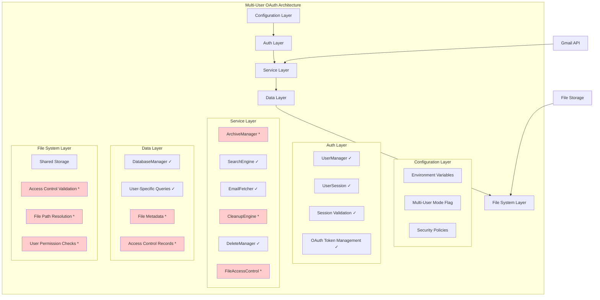
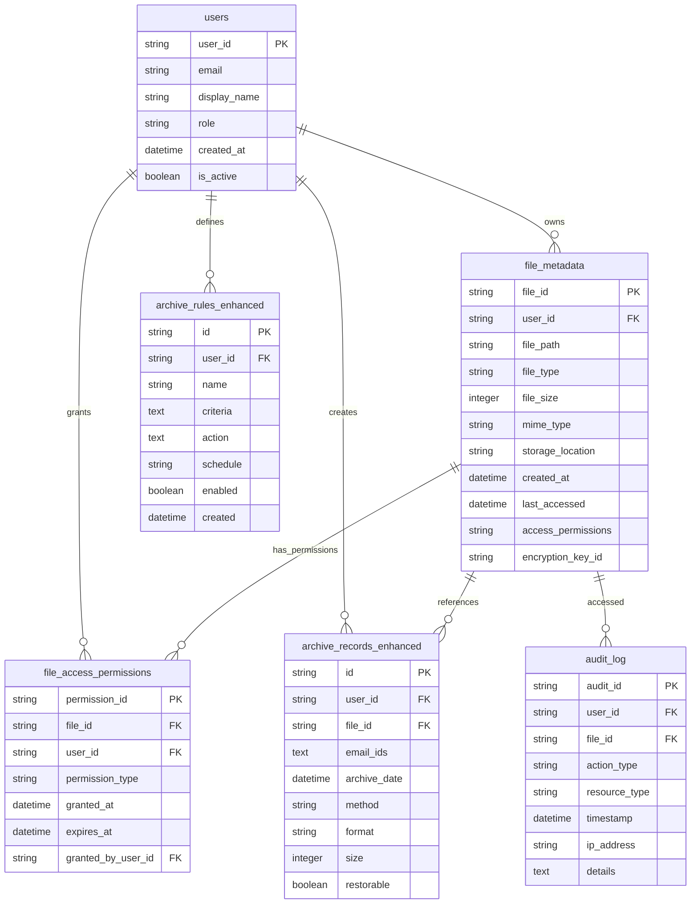
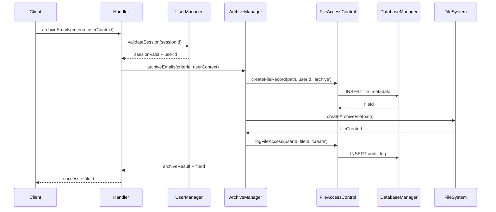

# Multi-User OAuth Architecture Plan for Gmail ArchiveManager

## Executive Summary

The Gmail MCP Server currently has **partial multi-user infrastructure** but critical security gaps in the ArchiveManager, file system access, and several other components. This plan provides a **configuration-driven approach** to enable secure multi-user OAuth with **database-centric file metadata management** and **shared storage with access controls**.

## Table of Contents

1. [Current State Analysis](#current-state-analysis)
2. [Architecture Overview](#architecture-overview)
3. [Database Schema Enhancements](#database-schema-enhancements)
4. [Implementation Phases](#implementation-phases)
5. [Security Framework](#security-framework)
6. [Configuration Management](#configuration-management)
7. [Implementation Timeline](#implementation-timeline)
8. [Risk Mitigation](#risk-mitigation)
9. [Testing Strategy](#testing-strategy)

## Current State Analysis

### ✅ Already Implemented (Strong Foundation)

- **Multi-user Auth Infrastructure**: `AuthManager`, `UserManager`, `UserSession` classes
- **Database Schema**: User-aware `DatabaseManager` with `user_id` fields in:
  - `email_index` table (line 178)
  - `saved_searches` table (line 223) 
  - `job_statuses` table (line 437)
- **Search Engine**: Full user context validation in `SearchEngine.ts`
- **Tool Handler**: User context validation framework in `handler.ts`
- **User-Specific Operations**: 
  - `searchEmails()` with user filtering (lines 944-953)
  - `saveSearch()` with user context (lines 166-214)
  - `getEmailStatistics()` with user isolation (lines 268-320)
- **Comprehensive Testing**: Multi-user auth and data isolation tests

### ❌ Critical Security Gaps

- **ArchiveManager**: No user context validation, shared Gmail client access
- **File System**: Shared archive paths without user access control
- **Cache Management**: No user-specific cache isolation
- **Archive Records**: `archive_records` table lacks `user_id` field
- **Archive Rules**: `archive_rules` table lacks user scope
- **File Access Control**: No permission validation infrastructure

## Architecture Overview



**Legend**: ✓ = Implemented, * = Needs Implementation

## Database Schema Enhancements

### Enhanced Entity Relationship Diagram



### New Database Tables

#### File Metadata Table
```sql
CREATE TABLE IF NOT EXISTS file_metadata (
  file_id TEXT PRIMARY KEY,
  user_id TEXT NOT NULL,
  file_path TEXT NOT NULL,
  file_type TEXT NOT NULL CHECK(file_type IN ('archive', 'export', 'backup', 'temp')),
  file_size INTEGER NOT NULL,
  mime_type TEXT,
  storage_location TEXT NOT NULL,
  created_at INTEGER DEFAULT (strftime('%s', 'now')),
  last_accessed INTEGER DEFAULT (strftime('%s', 'now')),
  access_permissions TEXT DEFAULT 'owner_only', -- JSON: {"read": ["user1"], "write": ["user1"]}
  encryption_key_id TEXT,
  metadata_json TEXT, -- Additional file-specific metadata
  FOREIGN KEY (user_id) REFERENCES users(user_id)
);
```

#### File Access Permissions Table
```sql
CREATE TABLE IF NOT EXISTS file_access_permissions (
  permission_id TEXT PRIMARY KEY,
  file_id TEXT NOT NULL,
  user_id TEXT NOT NULL,
  permission_type TEXT NOT NULL CHECK(permission_type IN ('read', 'write', 'delete', 'share')),
  granted_at INTEGER DEFAULT (strftime('%s', 'now')),
  expires_at INTEGER,
  granted_by_user_id TEXT NOT NULL,
  FOREIGN KEY (file_id) REFERENCES file_metadata(file_id) ON DELETE CASCADE,
  FOREIGN KEY (user_id) REFERENCES users(user_id),
  FOREIGN KEY (granted_by_user_id) REFERENCES users(user_id)
);
```

#### Enhanced Audit Logging Table
```sql
CREATE TABLE IF NOT EXISTS audit_log (
  audit_id TEXT PRIMARY KEY,
  user_id TEXT,
  file_id TEXT,
  action_type TEXT NOT NULL CHECK(action_type IN ('create', 'read', 'write', 'delete', 'share', 'access_denied')),
  resource_type TEXT NOT NULL CHECK(resource_type IN ('file', 'archive', 'export', 'search', 'email')),
  timestamp INTEGER DEFAULT (strftime('%s', 'now')),
  ip_address TEXT,
  user_agent TEXT,
  success BOOLEAN DEFAULT TRUE,
  details TEXT, -- JSON with additional context
  FOREIGN KEY (user_id) REFERENCES users(user_id),
  FOREIGN KEY (file_id) REFERENCES file_metadata(file_id)
);
```

### Existing Table Modifications

#### Archive Records Enhancement
```sql
ALTER TABLE archive_records ADD COLUMN user_id TEXT;
ALTER TABLE archive_records ADD COLUMN file_id TEXT;
ALTER TABLE archive_records ADD FOREIGN KEY (user_id) REFERENCES users(user_id);
ALTER TABLE archive_records ADD FOREIGN KEY (file_id) REFERENCES file_metadata(file_id);
```

#### Archive Rules Enhancement
```sql
ALTER TABLE archive_rules ADD COLUMN user_id TEXT;
ALTER TABLE archive_rules ADD FOREIGN KEY (user_id) REFERENCES users(user_id);
```

### Performance Optimization Indexes
```sql
CREATE INDEX IF NOT EXISTS idx_file_metadata_user_id ON file_metadata(user_id);
CREATE INDEX IF NOT EXISTS idx_file_metadata_file_type ON file_metadata(file_type);
CREATE INDEX IF NOT EXISTS idx_file_access_permissions_file_id ON file_access_permissions(file_id);
CREATE INDEX IF NOT EXISTS idx_file_access_permissions_user_id ON file_access_permissions(user_id);
CREATE INDEX IF NOT EXISTS idx_audit_log_user_id ON audit_log(user_id);
CREATE INDEX IF NOT EXISTS idx_audit_log_timestamp ON audit_log(timestamp);
CREATE INDEX IF NOT EXISTS idx_audit_log_action_type ON audit_log(action_type);
```

## Implementation Phases

### Phase 1: Critical Security Fixes (Priority 1)

#### 1.1 Database Schema Migration
- **Duration**: 3-4 days
- **Deliverables**:
  - Create new file metadata and permission tables
  - Add user_id fields to existing tables
  - Create database migration scripts
  - Performance optimization indexes

#### 1.2 FileAccessControlManager Implementation
- **Duration**: 4-5 days
- **Deliverables**:
```typescript
interface FileAccessControlManager {
  // File creation with user ownership
  createFileRecord(filePath: string, userId: string, fileType: FileType): Promise<string>
  
  // Permission validation
  validateFileAccess(fileId: string, userId: string, permissionType: PermissionType): Promise<boolean>
  
  // File metadata management
  getFileMetadata(fileId: string, userId: string): Promise<FileMetadata | null>
  updateFileMetadata(fileId: string, updates: Partial<FileMetadata>, userId: string): Promise<void>
  
  // Permission management
  grantFileAccess(fileId: string, targetUserId: string, permissionType: PermissionType, grantedByUserId: string): Promise<void>
  revokeFileAccess(fileId: string, targetUserId: string, permissionType: PermissionType, revokedByUserId: string): Promise<void>
  
  // Audit logging
  logFileAccess(userId: string, fileId: string, action: string, success: boolean, details?: any): Promise<void>
  
  // File cleanup and maintenance
  cleanupExpiredPermissions(): Promise<number>
  deleteUserFiles(userId: string): Promise<number>
}
```

#### 1.3 ArchiveManager User Context Integration
- **Duration**: 5-6 days
- **Deliverables**:
```typescript
class ArchiveManager {
  async archiveEmails(options: ArchiveOptions, userContext: UserContext): Promise<ArchiveResult> {
    // 1. Validate user session
    await this.validateUserContext(userContext);
    
    // 2. Get user-specific Gmail client
    const gmailClient = await this.authManager.getGmailClient(userContext.session_id);
    
    // 3. Create secure file path and metadata record
    const fileId = await this.fileAccessControl.createFileRecord(
      options.exportPath, 
      userContext.user_id, 
      'archive'
    );
    
    // 4. Perform archive operation with user context
    const result = await this.performArchiveOperation(options, gmailClient, userContext);
    
    // 5. Log audit trail
    await this.fileAccessControl.logFileAccess(
      userContext.user_id, 
      fileId, 
      'archive_created', 
      true, 
      { emailCount: result.archivedCount }
    );
    
    return { ...result, fileId };
  }

  async restoreEmails(options: RestoreOptions, userContext: UserContext): Promise<RestoreResult> {
    // 1. Validate user can access the archive file
    const canAccess = await this.fileAccessControl.validateFileAccess(
      options.archiveId, 
      userContext.user_id, 
      'read'
    );
    
    if (!canAccess) {
      throw new Error('Access denied: You do not have permission to access this archive');
    }
    
    // 2. Proceed with restore operation
    // ... rest of implementation
  }
}
```

### Phase 2: Configuration-Driven Multi-User Mode (Priority 2)

#### 2.1 Environment Configuration Framework
- **Duration**: 2-3 days
- **Deliverables**:
```env
# Multi-User Mode Configuration
MULTI_USER_MODE=true
MAX_USERS_PER_INSTANCE=100
SESSION_TIMEOUT_HOURS=24

# File System Security Configuration
FILE_STORAGE_BASE_PATH=/secure/archives
MAX_FILE_SIZE_MB=100
ALLOWED_FILE_TYPES=.eml,.mbox,.zip,.json
FILE_ENCRYPTION_ENABLED=true
AUDIT_RETENTION_DAYS=365

# Database Configuration
DB_ENCRYPTION_ENABLED=true
DB_CONNECTION_POOL_SIZE=10
DB_TIMEOUT_SECONDS=30
```

#### 2.2 Mode Detection and Initialization
- **Duration**: 2-3 days
- **Deliverables**:
```typescript
class ConfigManager {
  static isMultiUserMode(): boolean
  static getMaxUsers(): number
  static getSessionTimeout(): number
  static requiresAdminApproval(): boolean
}

class SystemInitializer {
  async initializeMode(): Promise<void> {
    if (ConfigManager.isMultiUserMode()) {
      await this.initializeMultiUserMode();
    } else {
      await this.initializeSingleUserMode();
    }
  }
}
```

### Phase 3: Enhanced Integration and Security (Priority 3)

#### 3.1 Cache Manager User Isolation
- **Duration**: 2-3 days
- **Deliverables**:
```typescript
class CacheManager {
  set(key: string, value: any, userId?: string): void
  get<T>(key: string, userId?: string): T | undefined
  
  private getUserCacheKey(key: string, userId: string): string {
    return `user:${userId}:${key}`;
  }
}
```

#### 3.2 Security Policy Framework
- **Duration**: 3-4 days
- **Deliverables**:
```typescript
interface SecurityPolicyManager {
  // File access policies
  enforceFileAccessPolicy(userId: string, fileId: string, action: string): Promise<boolean>
  
  // User data isolation policies
  enforceDataIsolationPolicy(requestingUserId: string, targetUserId: string): Promise<boolean>
  
  // Session management policies
  enforceSessionPolicy(sessionId: string): Promise<boolean>
  
  // Audit and compliance
  generateComplianceReport(startDate: Date, endDate: Date): Promise<ComplianceReport>
}
```

### Phase 4: Data Migration and Testing (Priority 4)

#### 4.1 Migration Strategy
- **Duration**: 3-4 days
- **Deliverables**:
```typescript
class MigrationManager {
  async migrateSingleUserData(): Promise<MigrationResult>
  async createDefaultAdminUser(): Promise<UserProfile>
  async migrateFileReferences(): Promise<void>
  async migrateArchiveRecords(): Promise<void>
}
```

#### 4.2 Comprehensive Testing Suite
- **Duration**: 4-5 days
- **Deliverables**:
```typescript
interface SecurityTestSuite {
  // Cross-user access prevention
  testCrossUserFileAccess(): Promise<TestResult>
  testCrossUserDataIsolation(): Promise<TestResult>
  
  // Permission boundary testing
  testFilePermissionEnforcement(): Promise<TestResult>
  testSessionValidation(): Promise<TestResult>
  
  // Audit trail verification
  testAuditLogCompleteness(): Promise<TestResult>
  testComplianceReporting(): Promise<TestResult>
}
```

## Security Framework

### Multi-User Authentication Flow



### Cross-User Data Protection

#### Database Level
- **User Filtering**: All queries filtered by `user_id`
- **Foreign Key Constraints**: Enforce referential integrity
- **Index Optimization**: Performance with user-specific queries

#### API Level
- **User Context Validation**: Every request validates session
- **Permission Checks**: File access validation before operations
- **Audit Logging**: All actions logged with user context

#### File Level
- **Database-Tracked Access**: File permissions stored in database
- **File ID Resolution**: Virtual file IDs instead of direct paths
- **Access Control Validation**: Permission checks before file operations

### Session Security
- **Token Encryption**: OAuth tokens encrypted per user
- **Session Expiration**: Configurable timeout policies
- **Session Invalidation**: Immediate revocation capabilities
- **Concurrent Session Limits**: Prevent session hijacking

### Admin vs User Separation
- **Admin Tools**: Separate admin-only endpoints
- **User Registration**: Admin approval workflow
- **System Monitoring**: Admin-only system health access
- **Data Access**: Admins can access all user data with audit trails

## Configuration Management

### Environment Variables
```bash
# Core Multi-User Settings
MULTI_USER_MODE=true
MAX_USERS_PER_INSTANCE=100
SESSION_TIMEOUT_HOURS=24
REQUIRE_ADMIN_APPROVAL=true

# File System Security
FILE_STORAGE_BASE_PATH=/secure/archives
MAX_FILE_SIZE_MB=100
ALLOWED_FILE_TYPES=.eml,.mbox,.zip,.json
FILE_ENCRYPTION_ENABLED=true

# Database Security
DB_ENCRYPTION_ENABLED=true
DB_CONNECTION_POOL_SIZE=10
DB_TIMEOUT_SECONDS=30

# Audit and Compliance
AUDIT_RETENTION_DAYS=365
AUDIT_LOG_LEVEL=INFO
COMPLIANCE_REPORTING_ENABLED=true
```

### Configuration Validation
```typescript
interface ConfigValidator {
  validateMultiUserConfig(): ConfigValidationResult
  validateSecurityConfig(): ConfigValidationResult
  validateDatabaseConfig(): ConfigValidationResult
  generateConfigReport(): ConfigReport
}
```

## Implementation Timeline

| Phase | Duration | Key Deliverables | Dependencies |
|-------|----------|------------------|--------------|
| **Phase 1** | 2 weeks | Database migration, FileAccessControl, ArchiveManager fixes | Database schema design approval |
| **Phase 2** | 1 week | Configuration framework, Mode detection | Phase 1 completion |
| **Phase 3** | 1.5 weeks | Cache isolation, Security policies | Phase 2 completion |
| **Phase 4** | 1.5 weeks | Migration tools, Testing suite | All previous phases |
| **Total** | **6 weeks** | Complete multi-user OAuth system | - |

### Critical Path Dependencies
1. **Database Schema Migration** → All subsequent development
2. **FileAccessControlManager** → ArchiveManager integration
3. **Configuration Framework** → Mode detection and security policies
4. **Security Testing** → Production readiness validation

## Risk Mitigation

### Backward Compatibility
- **Single-user mode preserved** when `MULTI_USER_MODE=false`
- **Gradual migration path** from single to multi-user
- **Legacy API support** during transition period
- **Database migration rollback** procedures

### Performance Impact
- **Minimal overhead** for user context validation (< 5ms per request)
- **Efficient database queries** with proper indexing
- **Cache optimization** for user-specific data
- **Connection pooling** for database performance

### Security Validation
- **Comprehensive test suite** for data isolation
- **Security audit framework** for ongoing validation
- **Penetration testing** for cross-user access attempts
- **Compliance reporting** for audit requirements

### Data Integrity
- **Transactional operations** for multi-table updates
- **Foreign key constraints** for referential integrity
- **Backup and recovery** procedures for migration
- **Data validation** at application and database levels

## Testing Strategy

### Unit Testing
- **FileAccessControlManager** component tests
- **User context validation** tests
- **Permission boundary** tests
- **Configuration validation** tests

### Integration Testing
- **Multi-user workflow** end-to-end tests
- **Cross-service communication** tests
- **Database transaction** tests
- **File system isolation** tests

### Security Testing
- **Cross-user access prevention** tests
- **Session hijacking prevention** tests
- **SQL injection prevention** tests
- **File system traversal prevention** tests

### Performance Testing
- **Concurrent user load** testing
- **Database query performance** testing
- **File operation performance** testing
- **Memory usage optimization** testing

### Compliance Testing
- **Audit trail completeness** verification
- **Data retention policy** compliance
- **Access logging accuracy** validation
- **Compliance reporting** verification

## Conclusion

This multi-user OAuth implementation plan provides a **secure, scalable architecture** that:

1. **Maintains backward compatibility** with single-user mode
2. **Implements robust security controls** for user data isolation
3. **Provides database-centric file access control** for shared storage
4. **Includes comprehensive audit logging** for compliance
5. **Offers configuration-driven deployment** for flexible environments

The plan addresses all identified security gaps while building upon the existing multi-user infrastructure. The phased approach ensures systematic implementation with proper testing and validation at each stage.

## Next Steps

1. **Review and approval** of this architectural plan
2. **Database schema design review** with stakeholders
3. **Security policy definition** for organizational requirements
4. **Development team assignment** and sprint planning
5. **Implementation kickoff** with Phase 1 database migration

---

**Document Version**: 1.0  
**Last Updated**: 2025-06-22  
**Author**: Technical Architecture Team  
**Status**: Ready for Implementation